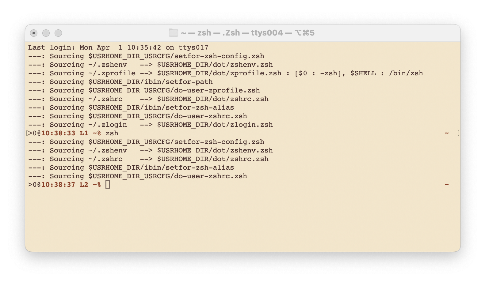

===========================================================
USRHOME -- Easily Clonable Unix Shell Configuration & Tools
===========================================================

.. image:: https://img.shields.io/:License-gpl3-blue.svg
   :alt: License
   :target: https://www.gnu.org/licenses/gpl-3.0.html

.. image:: https://img.shields.io/badge/State-Stable,_zsh_support_only-yellow
   :alt: Version
   :target: https://github.com/pierre-rouleau/usrhome

.. image:: https://img.shields.io/badge/Supports-macOS_zsh-green
   :target: https://raw.githubusercontent.com/pierre-rouleau/pel/master/doc/pdf/lang/zsh.pdf

.. image:: https://img.shields.io/badge/Supports-Kali_Linux_zsh-green
   :target: #using-usrhome-on-kali-linux

.. image:: https://img.shields.io/badge/Installer_tested_on-macOS_zsh-green
   :target: #how-to-set-it-up

.. image:: https://img.shields.io/badge/Installer_tested_on-Kali_Linux_zsh-green
   :target: #how-to-set-it-up

:Author:  Pierre Rouleau
:Copyright: © 2024, Pierre Rouleau

.. ---------------------------------------------------------------------------

USRHOME is a starting project with the goal of holding a set of portable
Unix shell configuration files that:

- can be used in macOS and multiple Linux distributions under
  the `Z Shell`_ and Bash,
- support multiple computers:

  - the central configuration logic is inside this USRHOME Git repository,
  - the user-specific configuration logic for several computers or VMs
    is stored inside a *sibling*, private, repository; the *usrcfg*.

- All shell configuration files are symbolic links to `USRHOME dot files`_,
  allowing the logic to be under VCS control.

USRHOME allows you to store shell configuration logic inside the USRHOME and
you usrcfg repository.  That can be used inside all the computers you use and
they may have different configuration.
The goal is to be able to store all shell configuration logic
into two VCS repositories: the public one (this) and your private one.

At the moment it supports:

- A basic configuration of zsh for macOS.  It works when zsh is used as the
  default shell, as its the case on macOS since macOS 10.15 Catalina.  It also
  works on older versions of macOS where the older version of Bash is still
  the default shell. On these system just invoke zsh as a sub-shell to use it
  and try the features the older version of zsh provides.  USRHOME works fine
  on those and configures the prompt.

The intent is *not* to provide colourful configurations with fancy fonts and
emoji but just provide a basic environment that will work over several
versions of Operating Systems and will support the Z Shell as well as Bash
running in the default terminal emulator programs provided by the OS.

These are:

- the default macOS Terminal.app,
- the default Linux terminal applications,
- inside Emacs various terminal shell modes,

and work well when used with my `Pragmatic Emacs Library`_ which provides
extensive key bindings for use in these Operating systems and allow extended
use of the `numeric keypad`_.

USRHOME makes one important assumption about the organization of the
directories in your file system: it specifically assumes that:

- The directory that holds the USRHOME directory tree also holds
  a directory tree called ``usrcfg`` that holds the user-specific
  and private configuration information.

The sections titled `The zsh Configuration Files`_ and
`The User Configuration Files used by USRHOME`_  describe the files used.

On shell startup, USRHOME takes over and sets the value of several environment
variables that identify the location of directories and USRHOME state.

The code supports the Emacs editor, by using the INSIDE_EMACS environment
variable to control the behaviour of some features when they are invoked
inside a shell running inside Emacs.

How to Set it Up
================

- Clone the USRHOME repository somewhere on your home directory tree.
- Open a Z Shell by typing ``zsh`` if you are not already inside a Z Shell.
- Execute the `setup/setup-usrhome`_  script **from the root directory
  of the USRHOME depot**:

  - It will print what will be done and prompt before proceeding:

    - Create a ``usrcfg`` directory inside the same directory that
      holds the ``usrhome`` directory.
    - Create the ``usrcfg/setfor-zsh-config.zsh`` file that will
      hold your persistent and private configuration.  At first the file will
      be a copy of a the `usrhome/setup/template/setfor-zsh-config.zsh`_ with
      extra information appended.
    - Finally create symbolic link in your home directory to point
      to the Z Shell configuration files stored inside the `usrhome/dot`_
      directory.  Before proceeding it will create backup of files that are
      already present.

Once that's done you should be able to open a Z Shell with the ``zsh`` command
and see the basic prompt supported by the project and have access to the
commands documented below.

The next step will to migrate any Z Shell startup logic you might have had in
your old files that have been backed up by the startup script.  USRHOME
expects that extra user-specific logic to be stored inside files located
inside the usrcfg directory.

  For that you need to understand which file is sourced when the Z Shell is started
  in the various ways it is started. Read the section titled
  `The Z Shell Startup, Dot Files and User Configuration`_
  for details on that.

  Then you can decide to use your original ``~/.zshrc`` and other Z Shell configuration
  files that have been backed-up by `setup/setup-usrhome`_ and copy all or part of their
  content inside the corresponding files inside the usrcfg directory.

  You can also take a look at the other example files located in the `usrhome/template`_
  directory and use ideas from there.

Conventions
===========

- All environment variables used by USRHOME have a name that starts
  with ``USRHOME_``.
- All of those that identify the path of a directory have a name that starts with
  ``USRHOME_DIR_``.

The zsh Configuration Files
---------------------------

========================= =====================================================
Location of Symbolic Link Location of the USRHOME files pointed by the symlinks
========================= =====================================================
``~/.zshenv``             ``$USRHOME_DIR/dot/zshenv.zsh``
``~/.zprofile``           ``$USRHOME_DIR/dot/zprofile.zsh``
``~/.zshrc``              ``$USRHOME_DIR/dot/zshrc.zsh``
``~/.zlogin``             ``$USRHOME_DIR/dot/zlogin.zsh``
``~/.zlogout``            ``$USRHOME_DIR/dot/zlogout.zsh``
========================= =====================================================

The User Configuration Files used by USRHOME
--------------------------------------------

=============================== ===============================================
File Name                       Description
=============================== ===============================================
usrcfg/setfor-zsh-config.zsh    Persistent, user-specific basic USRHOME configuration.
usrcfg/do-user-zprofile.zsh     User-specific Z Shell zprofile logic.
usrcfg/do-user-zshrc.zsh        User-specific Z Shell zshrc logic.
=============================== ===============================================

As said above the usrcfg directory is expected to be a sibling to the usrhome
directory; they must both be inside the same parent directory.
USRHOME sets the ``USRHOME_DIR_USRCFG`` environment variable to hold the full
path of the usrcfg directory.

See the section titled
`The Z Shell Startup, Dot Files and User Configuration`_
for more information.

The USRHOME Configuration Environment Variables
-----------------------------------------------

The file usrcfg/setfor-zsh-config.zsh holds the definition of the following
environment variables.

=============================== =================================================
Environment Variable Name       Purpose
=============================== =================================================
USRHOME_TRACE_SHELL_CONFIG      Set to 1 to activate tracing of the configuration
                                file sourcing.
                                Use the ``usrhome-shell-toggle-tracing``
                                command to
                                toggle this in the current shell.

USRHOME_PROMPT_SHOW_USR_HOST    Set to 1 to display user name and host name
                                in the prompt.
                                Use the ``usrhome-prompt-toggle-usr-host``
                                command to
                                toggle this in the current shell.

USRHOME_USE_HOMEBREW            Set to 1 when using Homebrew, to add Homebrew
                                directories to the PATH.

USRHOME_DIR                     Path to the usrhome directory.
                                The setup/setup-usrhome installation script
                                appends code to set the value of that
                                environment variable.

USRHOME_PROMPT_MODEL            Optional environment variable.  Identifies the
                                syntax of the prompt used by the shell. The
                                supported values are:

                                - **0** : no prompt defined by USRHOME. The user
                                  can defined a prompt inside the
                                  ``usrcfg/do-user-zshrc.zsh`` file.
                                  If nothing is defined, zsh will use it's
                                  default prompt.

                                - **1** : (or not defined).
                                  Selects the default USRHOME prompt style
                                  shown in the example_. This is on one line
                                  but uses the ``RPROMPT`` to show the VCS
                                  information.
                                  The search regexp for that prompt model is
                                  ``^>[0-9]+@.+[%#]``

                                - **2** : A 2-line prompt that displays the
                                  complete path and the VCS info on the
                                  left-hand side.  Commands are typed on the
                                  second line right after a "%' or '#' leading
                                  character followed by a space.
                                  The search regexp for that prompt model is
                                  ``^[%#]``

                                Users can change the prompt dynamically by
                                issuing a clrenv or setenv command to change
                                the value of the variable and then either
                                start a new zsh shell or reset the current
                                one with ``exec zsh``.
=============================== =================================================

When USRHOME Z Shell startup logic executes, USRHOME sets these other
environment variables:

=============================== =================================================
Environment Variable Name       Purpose
=============================== =================================================
USRHOME_DIR_DV                  Development directory, used by USRHOME `Directory Navigation`_.
USRHOME_DIR_MY                  Main user directory, used by USRHOME `Directory Navigation`_.
USRHOME_DIR_PRIV                Private development directory, , used by USRHOME `Directory Navigation`_.
USRHOME_DIR_PUB                 Public development directory, , used by USRHOME `Directory Navigation`_.
USRHOME_DIR_USRCFG              The path of the user configuration directory.
                                Something like ``/Users/roup/my/dv/usrcfg``
USRHOME_PATH_SET                Internal logic flag.
=============================== =================================================

USRHOME Commands and Scripts
----------------------------

Shell Behavior Control
~~~~~~~~~~~~~~~~~~~~~~

================================== ================================================================
USRHOME Command Name               Description
================================== ================================================================
``usrhome-shell-toggle-tracing``   Toggle tracing the execution of the shell configuration files
                                   when a shell starts.  This toggles the value of the
                                   ``USRHOME_TRACE_SHELL_CONFIG`` environment variable from 0 to 1
                                   and vice-versa.  The original value is set inside your
                                   usrcfg/setfor-zsh-config.zsh file.  The default value is 0 as
                                   identified by `usrhome/setup/template/setfor-zsh-config.zsh`_
                                   used to initialize the usrcfg file.

``usrhome-prompt-toggle-usr-host`` Toggle the inclusion of the user name and host name inside
                                   the prompt.
================================== ================================================================

Shell Status Info
~~~~~~~~~~~~~~~~~

================================== ================================================================
USRHOME Command Name               Description
================================== ================================================================
``ss``                             Show current and default shell environment variable names
                                   and values.
================================== ================================================================

Terminal Window Control
~~~~~~~~~~~~~~~~~~~~~~~

================================== ================================================================
USRHOME Command Name               Description
================================== ================================================================
``set-title [TITLE]``              Set the terminal's title to the value passed as its first
                                   parameter.  The terminal title is shown on the window title bar.
                                   The command accepts only 1 parameter, so if you want to set the
                                   title with embedded spaces just quote the entire title.
                                   With no argument: removes the title.
================================== ================================================================

Directory Navigation
~~~~~~~~~~~~~~~~~~~~

Extensions to the ``cd`` command.

================================== ================================================================
USRHOME Command Name               Description
================================== ================================================================
``..``                             Alias to ``cd ..``
``...``                            Alias to ``cd ../..``
``....``                           Alias to ``cd ../../..``

``cd-to FNAME``                    cd to the sub-directory that holds the file ``FNAME``.
                                   It reports an error if the file is not found or if more than
                                   one is found.
                                   This command requires the fd_ utility.
``cdv [SUBDIR]``                   cd to the ``/Volumes`` directory or specified ``SUBDIR``.
================================== ================================================================

The commands described below change the current directory to 4 conceptually important
directories, and those directories are identified by USRHOME environment variables.
The name of these environment variables start with the ``USRHOME_DIR_``
prefix. They are:

USRHOME_DIR_MY:
  The directory where all your development directories are located.  It is
  often different from ``HOME`` on systems like macOS; it could
  be ``$HOME/Documents`` if you want your files replicated by
  Apple iCloud or another directory, like ``$HOME/my`` if you do
  not want them replicated and stored in the iCloud.

USRHOME_DIR_DV:
  The directory where you store your main, or most-active, development sub-directories.
  For example on my systems I often have a ``~/code`` or ``~/my/code`` or ``~/my/dv``
  directory where I place my most active projects (or symlinks to these directories).
  This can be located anywhere.

USRHOME_DIR_PRIV:
  The directory where you store your *private* development sub-directories.
  That could be something you do not want to publish because it's not ready, or
  it could be the directories for your various contract work.
  This can be located anywhere.

USRHOME_DIR_PUB:
  The directory where you store your secondary, *public*, sub-directories.
  That could hold a set of repositories that are forks of other projects
  to which you contribute, or libraries and tools you want to build yourself,
  anything you do not consider your main or most-active development.
  This can be located anywhere.

These environment variables are defined in the user persistent configuration file:
usrcfg/setfor-zsh-config.zsh.  The `setup/setup-usrhome`_ script initializes them
to the value stored in `usrhome/setup/template/setfor-zsh-config.zsh`_ template file.

The following commands are shortcuts to change the current directory to one of these
directories.

================================== ================================================================
USRHOME Command Name               Description
================================== ================================================================
``cdh [SUBDIR]``                   cd to the directory identified by ``USRHOME_DIR_MY``
                                   or its identified ``SUBDIR``.

``cddv [SUBDIR]``                  cd to the directory identified by ``USRHOME_DIR_DV``
                                   or its identified ``SUBDIR``.

``cddpriv [SUBDIR]``               cd to the directory identified by ``USRHOME_DIR_PRIV``
                                   or its identified ``SUBDIR``.

``cddpub [SUBDIR]``                cd to the directory identified by ``USRHOME_DIR_PUB``
                                   or its identified ``SUBDIR``.
================================== ================================================================

Listing Files/Directories/Links
~~~~~~~~~~~~~~~~~~~~~~~~~~~~~~~

The following command shortcuts for specialized use of **ls** are provided by USRHOME.

================================== ================================================================
USRHOME Command Name               Description
================================== ================================================================
``l``                              Colorized **ls** that also shows the file type symbol.
``la``                             Same as ``l`` but also show hidden files.
``ll``                             ``ls -l`` with colorized and  file type symbols.
``lla``                            Same as ``ll`` but also show hidden files.
``lt``                             ``ls -ltr`` with colorized and  file type symbols.
``lta``                            Same as ``lt`` but also show hidden files.
``lsd``                            List sub-directories in current directory.
``lsl``                            List symbolic links in current directory.
================================== ================================================================

Environment Variables Commands
~~~~~~~~~~~~~~~~~~~~~~~~~~~~~~

The following commands help manage and read the content of environment variables.

================================== ================================================================
USRHOME Command Name               Description
================================== ================================================================
``clrenv VARNAME``                 Clear (remove) the environment variable specified by name from
                                   the environment of the *current* shell.

``setenv VARNAME VALUE``           Set the environment variable named VARNAME to the specified
                                   VALUE and inject it inside the *current* shell.

``showpath [-n] [MAN|LIB][PATH]``  Print the value of PATH, MANPATH or LIBPATH, placing each directory
                                   in its own line.
                                   With the optional ``-n``: print a left justified number on
                                   each line.
                                   Examples:

                                   - ``showpath`` : prints PATH, one directory per line,
                                   - ``showpath PATH``: prints PATH, one directory per line,
                                   - ``showpath -n``: prints PATH with numbered lines,
                                   - ``showpath -n PATH``: prints PATH with numbered lines,
                                   - ``showpath -n MANPATH``: prints MANPATH with numbered lines,
                                   - ``showpath MAN``: prints MANPATH without numbers.

                                   If the format of the path variable is incorrect, the command
                                   prints an error message on stderr. The errors detected include
                                   a leading or trailing separator or multiple consecutive
                                   separators.  The exit code are:

                                   - 0 on success,
                                   - 1 on invalid argument(s),
                                   - 2 when specified environment variable is not defined,
                                   - 3 when the format of the specified path is incorrect.

                                   Note: when MANPATH is empty, ``showpath`` uses the manpath_
                                   command (if available) and prints the path it returns.  It also
                                   prints a warning on stderr and exit with an exit-code of 0.
================================== ================================================================

Miscellaneous Commands
~~~~~~~~~~~~~~~~~~~~~~

================================== ================================================================
USRHOME Command Name               Description
================================== ================================================================
``cls``                            Shortcut for ``clear``; clear the content of the shell window.
``md``                             Shortcut for ``mkdir``
``mdd DIRPATH``                    A mkdir followed by cd.  If DIRPATH has '/', then create
                                   intermediate directories as required and print them on stdout.
``p3``                             Shortcut for ``python3``
================================== ================================================================

Project Startup Commands
~~~~~~~~~~~~~~~~~~~~~~~~

================================== ================================================================
USRHOME Command Name               Description
================================== ================================================================
``pel [SUBDIR]``                   Change current directory to PEL_ depot directory or its SUBDIR
                                   if specified.
                                   Set terminal title to 'PEL'.

``usrhome [SUBDIR]``               Change current directory to USRHOME depot directory
                                   or its SUBDIR if specified.
                                   Set terminal title to 'USRHOME'.

``usrcfg [SUBDIR]``                Change current directory to the USRHOME personal/persistent
                                   configuration directory, usrcfg
                                   or its SUBDIR if specified.
                                   Set terminal title to 'USRHOME:usrcfg'
================================== ================================================================

The Prompt
~~~~~~~~~~

The zsh prompt
^^^^^^^^^^^^^^

USRHOME sets up a basic Z Shell prompt that does not need any zsh extension
library. The default prompt (prompt model 1) shows:

- A leading '>' character,
- the exit code of the last command, in decimal,
- current time in 24-hour HH:MM:SS format,
- the shell nested level, prefixed with 'L',
- optional user-name @ host-name,
- the last 3 directory components of the current directory,
- the last character is '#' if the current user has root privilege,
  otherwise the '%' character is used.

When there is enough room, the right side prompt (RPROMPT) is shown with:

- The full path of the current directory.
- If the current directory is inside a Git or Mercurial repository, the
  repository branch and repository name.  In a Mercurial repository the 'hg:'
  prefix is included.

An example is shown here:

.. figure:: res/zsh-prompt-01.png

What is shown above corresponds to USRHOME default prompt.
USRHOME supports other prompts, selected by the value of the optional
USRHOME_PROMPT_MODEL environment variable that holds a prompt model value.

- The value for the default prompt is 1 (but it's also the model selected if the
  variable is not defined).
- A value of 2 selects a prompt that spans 2 lines and always displays the
  complete path of the current directory, along with any available VCS info
  on the left side of the first line.  The second line starts with ``%`` or
  `#`` followed by a single space.

Here's an example when the prompt model 2 is selected by user configuration
and the user dynamically changes it inside the shell.

Prompt Search Regexp
++++++++++++++++++++

With the above prompt, the default prompt, you can use the following regular
expression to navigate to prompt lines inside a log within the prompt lines
inside an Emacs terminal or shell mode buffer:  ``^>[0-9]+@.+[%#]``

The regexp for prompt model 2 is simpler: ``^[%#]``

Command and Script Organization
-------------------------------

USRHOME provides several types of command and scripts, as listed here.

============================= ================== =================================================
Name format of scripts        Type of script     Purpose
============================= ================== =================================================
``USRHOME/ibin/do-CMD``       Sourced script     Meant to be invoked by alias command ``CMD``
``USRHOME/ibin/setfor-CMD``   Sourced script     Meant to be invoked by alias command ``CMD``
``USRHOME/ibin/envfor-ENV``   Sourced script     Meant to be invoked by alias command ``use-ENV``
``USRHOME/bin/...``           Shell script       A regular script that can be invoked directly.
============================= ================== =================================================

The commands alias are all sourcing a sourced script that *injects* or *modifies*
something inside the current running shell.  The source scripts all have names
that start with one of the identified prefixes: ``setfor-`` or ``envfor-``.

The ``setfor-`` sourced scripts are used by various USRHOME commands that
control the shell, such as ``usrhome-shell-toggle-tracing`` and
``usrhome-prompt-toggle-usr-host``.

The ``envfor-ENV`` sourced scripts are used by the equivalent ``use-ENV``
command.  These commands set the shell for the environment identified by the
``ENV`` suffix.  The idea is that when you start a shell it comes with a
minimal environment.  You can then activate a given environment by issuing the
corresponding ``use-`` command.  For example, assuming that you want to use
various tools for the Erlang, Factor, Rust or Zig programming languages but
separately, in each shells, you would use the ``use-erlang``, ``use-factor``,
``use-rust`` and ``use-zig`` commands that source their corresponding source
scripts that update the PATH and other environment variables that are
necessary for the environment.

As USRHOME grows, I will be adding several of these environment setting
scripts and commands to support various Operating Systems.

The Z Shell Startup, Dot Files and User Configuration
-----------------------------------------------------

The Z Shell has five different user configuration files:

- ~/.zshenv
- ~/.zprofile
- ~/.zshrc
- ~/.zlogin
- ~/.zlogout

USRHOME implements its own copy of each of these files, stored in the
usrhome/dot directory.  The files are named differently, without a leading
period and with a ``.zsh`` file extension.   That simplifies editing and
management on these files on various environments. Several tools require a
special option to process hidden files; it's not needed for these files since
they are not hidden.

However, to be used, USRHOME setup places them inside the user home directory,
creating hidden symlinks to the files.  The result is the following:

============== ==========================
Symbolic link  USRHOME File Identified
============== ==========================
~/.zshenv      usrhome/dot/zshenv.zsh
~/.zprofile    usrhome/dot/zprofile./zsh
~/.zshrc       usrhome/dot/zshrc.zsh
~/.zlogin      usrhome/dot/zlogin.zsh
~/.zlogout     usrhome/dot/zlogout.zsh
============== ==========================

The `files sourced by the Z Shell`_ depend on how the Z Shell is started.
The files sourced by USRHOME take advantage of that behaviour to inject the
user configuration, as shown in the following diagram.

- The ~/zshenv is sourced in all case.  Therefore the usrhome/dot/zshenv.zsh
  sources the user's configuration file.  That file controls the configurable
  aspects of USRHOME.
- The file usrhome/ibin/setfor-path controls adding extra directories in the
  PATH; the directories used by USRHOME and some other.  That file is sourced
  by the usrhome/dot/zprofile.zsh for a login shell and by the
  usrhome/dot/zshrc.zsh in a sub-shell.
- Since the usrhome/dot/zshrc.zsh is used both in the login and the sub-shell,
  it's the file that sources the usrhome/ibin/setfor-zsh-alias to inject
  the USRHOME commands inside the shell.  That's also the file that sanitizes
  the PATH; it removes empty entries and duplicates if there's any.  And in
  that case it prints a warning.  That's an indication to take a look at your
  configuration files (or to the application that launched a sub-shell).

The user can provide extra startup logic for the Z Shell.  USRHOME Z Shell
startup code sources the following user configuration files stored in the user
managed usrcfg directory:

- usrcfg/do-user-zprofile.zsh
- usrcfg/do-user-zshrc.zsh

Each of these files is sourced if they exist. The diagram shows the order in
which the files are sourced.

Activate Tracing of the Sourcing of the Shell Configuration Files
-----------------------------------------------------------------

By setting the value of ``USRHOME_TRACE_SHELL_CONFIG`` to 1 inside your
usrcfg/setfor-zsh-config.zsh file you activate USRHOME's tracing.  Then when
you open a new shell inside a terminal, or create a sub-shell, you can see
which file is sourced.

With all usrcfg files existing, this is what you'd see from macOS that uses the Z
Shell as the default shell when you open a new terminal and then create a
sub-shell inside it.  The name of the environment variables are shown instead
of the real path.

For comparison, here's the same inside shells started from within a terminal
based instance of Emacs with two shells, one running inside a shell-mode
buffer and another inside a term-mode buffer.  Notice that the Z Shell started
inside Emacs are sub-shells and therefore only execute the corresponding Z Shell
configuration files for that.

.. figure:: res/zsh-tracing-startup-term-emacs.png

From a graphical version of Emacs started from the system (and not from a
shell):

And a version of Aquamacs_ started from the system.  In that case you can see
that the USRHOME logic detects and reports redundant entries in the PATH that
is injected by the Aquamacs logic and then corrects them.

.. figure:: res/zsh-tracing-aquamacs.png

When the USRHOME_TRACE_SHELL_CONFIG is set to ``0`` instead of ``1``, USRHOME
startup configuration files do not display the entire warning. It just
mentions that USRHOME sanitized the PATH and how to see more as we can see here:

Adding Your Own Environment Customization to your Shell
=======================================================

You will most probably want to add features to your shells, over what USRHOME
provides. USRHOME provides several mechanism to do that, described in the
following sections with examples and files located in the setup/template
directory you can use as examples.

The use- commands -- Inject something in your local shell
---------------------------------------------------------

The idea here is to provide a set of sourced scripts and corresponding
commands to source them.  One set for each feature you want to inject into
your shell.  Something like providing access to a different implementation of
a command available to the Operating System, or adding support for the tools
required for a programming language.

The method:
  Add a ``use-ENV`` alias command that sources a ``envfor-ENV`` script,
  where ``ENV`` is the name of the environment concept.
  Add the alias statement into the usrcfg/do-user-zshrc.zsh file.
  Store the ``envfor-ENV`` script inside the usrcfg directory.

Examples follow.

use-curl-hb -- Activate Homebrew version of curl in the current shell.
~~~~~~~~~~~~~~~~~~~~~~~~~~~~~~~~~~~~~~~~~~~~~~~~~~~~~~~~~~~~~~~~~~~~~~

The version of curl_ available on macOS is often relatively old and may not
incorporate the latest vulnerability fixes. You may want to install the
latest available from Homebrew_ but once you install it it will warn you
that installing it permanently might cause problems with macOS.

A solution to this is to install the files ion your system but not install
the symlinks and not put it your your system's PATH. Homebrew does that.
Now if you want to use Homebrew's version of curl you need to ensure that it
will be piked up in the PATH before the system's one.

To do that we can place the following statement inside the
usrcfg/do-user-zshrc.zsh file:

.. code:: shell

          alias use-curl-hb='source $USRHOME_DIR_USRCFG/envfor-curl-hb'

And we store the logic we need into the usrcfg/envfor-curl-hb file.
In this specific case, there's not much.  Just this:

.. code:: shell

          export PATH="/opt/homebrew/opt/curl/bin:$PATH"

When we open a new Z Shell we can see the impact:

.. figure:: res/use-curl-hb.png

There's **no** impact in any other shells, and macOS continues to use its own
version of curl.  You can open another shell and it will use the native
version unless you execute the ``use-curl-hb`` command.

use-rust -- Activate Rust programming environment in current shell
~~~~~~~~~~~~~~~~~~~~~~~~~~~~~~~~~~~~~~~~~~~~~~~~~~~~~~~~~~~~~~~~~~

If you want to use the Rust_ programming language you most probably need to
install it in your system.  The default mechanism is to install it in the
system and each shell will have access to it.  You may also want to only limit
it to one given shell and start all tools from that shell (or shells).  That
what the ``use-rust`` command will do.

The first step is to install Rust_ and Cargo as described in it the
`Rust installation procedure`_, with::

  curl https://sh.rustup.rs -sSf | sh

Once it's done, you can use the ``git diff`` command to see what that changed
into your shell configuration that is now stored inside the USRHOME directory
tree.

.. figure:: res/rust-install.png

The Rust installation added the sourcing of "$HOME/.cargo/env" to your
USRHOME ``dot/zshenv.zsh`` file.  Recall that the ``~/.zshenv`` now the
USRHOME ``dot/zshenv.zsh``  is sourced every time a terminal opens a shell, at
the beginning, before everything else.  It also sources it when a sub-shell is
opened.  Looking into the ``$HOME/.cargo/env`` we can see that it
conditionally prepends the ``$HOME/.cargo/bin`` directory to the PATH.  At
least it won't do it several times.  But if you append that inside your Z
Shell configuration it will be available to all processes once you restart
your system.  It might be what you want. Or not.

If you just want to add Rust support in selected shells, then create a
``use-rust`` command.

- Remove the extra code that was appended to your
  USRHOME ``dot/zshenv.zsh`` file and place it inside a
  ``envfor-rust`` script located inside your usrcfg directory.
  At the same time add a little bit more to provide more info:

  .. code:: shell

            . "$HOME/.cargo/env"
            rustv="$(rustc --version)"
            echo "--- Rust $rustv Installed in shell"

- Add the ``use-rust`` alias to your
  usrcfg/do-user-zshrc.zsh file:

  .. code:: shell

            alias use-rust='source $USRHOME_DIR_USRCFG/envfor-rust'

Now you can inject Rust support by executing the ``use-rust`` command:

.. figure:: res/use-rust.png

As you can see no change is required in the files supplied by the USRHOME
project.  The customization is done inside your files, located in the usrcfg
directory tree.  That directory tree should also be under the control of a
version control system, like Git or anything else.  I also use Mercurial_ for
that purpose as you can see below.

Adding Permanent Environments to all Shells
-------------------------------------------

In some cases you may decide to add a feature to the system shell and all
shell instances. This way you won't have to type the required ``use-`` command
into each shell that requires it.

You can do that too with USRHOME. And there are several ways to do it; add the
sourcing of the corresponding ``envfor-`` file from one of the ``.zsh`` files
in the usrcfg.
Usually you will probably want to do that from the ``usrcfg/do-user-zshrc.zsh``.

With envfor-rust sourced inside the ``usrcfg/do-user-zshrc.zsh`` file, Rust
support is installed automatically inside all shells, including the system
Z Shell as we can see:

- from a Z Shell launched from Terminal.app:

  .. figure:: res/use-rust-03.png

- from a Z Shell opened inside a shell-mode terminal-type Emacs buffer:

  .. figure:: res/use-rust-in-e.png

- from a Z Shell opened inside a shell-mode graphical-type Emacs buffer:

  .. figure:: res/use-rust-in-ge.png

- from a Z Shell opened inside a shell-mode Aquamacs buffer:

  .. figure:: res/use-rust-in-aquamacs.png

Using USRHOME on Kali Linux
===========================

Kali Linux uses zsh as the default shell.
It has it's own prompt definition with  several Z Shell extensions
enabled, which the USRHOME default shell does not have yet.

You can still use USRHOME on Kali Linux and take advantage of the USRHOME commands
and philosophy of storing the USRHOME main code and the local shell
customization inside the usrcfg directory.  That can also be stored inside a
repository.  In this example, the usrcfg files are stored inside a Mercurial
repository.  The logic in the various files support multiple target
environment, which they select by checking the host name and other values.

This way, I can **centralize the shell setting of all computers or VMs** I use
inside **a single repository** that I clone inside the usrcfg directory of these
computers and VMs.  I can design the logic once, specialize it for varius
environments and distribute it through the VCS.

Here's a Kali Linux terminal with the Z shell using USRHOME selecting the
original Kali Linux Z Shell configuration (moved into the
``usrcfg/do-user-zshrc.zsh`` file and selected based on the USRHOME prompt
model value):

And then, after changing the color scheme of Kali Linux terminal, two
terminals, one running the terminal version of Emacs launched with an alias to
``emacs -nw`` and the graphical version of Emacs launched from the shell with a shell
function that captures the current working directory and runs in background.
You can see the prompts inside the Emacs shell-mode and term-mode buffers.

.. figure:: res/on-kali-linux-02.png

Feedback's Welcome!
===================

If you stumble on this page and find this project interesting but falling
short somewhere, let me know.  Create an issue or propose a change or addition
through a pull-request.

Thanks!

.. ---------------------------------------------------------------------------
.. links

.. _PEL:
.. _Pragmatic Emacs Library:                      https://github.com/pierre-rouleau/pel#readme
.. _numeric keypad:                               https://raw.githubusercontent.com/pierre-rouleau/pel/master/doc/pdf/numkeypad.pdf
.. _fd:                                           https://github.com/sharkdp/fd#readme
.. _setup/setup-usrhome:                          https://github.com/pierre-rouleau/usrhome/blob/main/setup/setup-usrhome
.. _usrhome/setup/template/setfor-zsh-config.zsh: https://github.com/pierre-rouleau/usrhome/blob/main/setup/template/setfor-zsh-config.zsh
.. _usrhome/template:                             https://github.com/pierre-rouleau/usrhome/blob/main/setup/template
.. _USRHOME dot files:
.. _usrhome/dot:                                  https://github.com/pierre-rouleau/usrhome/tree/main/dot
.. _The Z Shell Startup, Dot Files and User Configuration: #the-z-shell-startup-dot-files-and-user-configuration
.. _Z Shell:                                      https://en.wikipedia.org/wiki/Z_shell
.. _files sourced by the Z Shell:                 https://raw.githubusercontent.com/pierre-rouleau/pel/master/doc/pdf/lang/zsh.pdf
.. _Aquamacs:                                     https://aquamacs.org
.. _curl:                                         https://en.wikipedia.org/wiki/CURL
.. _Homebrew:                                     https://en.wikipedia.org/wiki/Homebrew_(package_manager)
.. _Rust:                                         https://en.wikipedia.org/wiki/Rust_(programming_language)
.. _Rust installation procedure:                  https://doc.rust-lang.org/cargo/getting-started/installation.html
.. _Mercurial:                                    https://en.wikipedia.org/wiki/Mercurial
.. _manpath:                                      https://man7.org/linux/man-pages/man1/manpath.1.html
.. _example:                                      `The zsh prompt`_

.. ---------------------------------------------------------------------------
