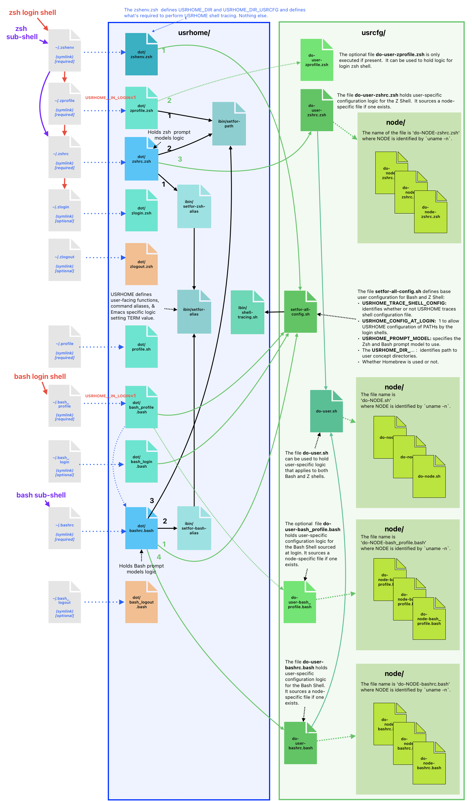

===========================================================
USRHOME -- Easily Clonable Unix Shell Configuration & Tools
===========================================================

.. image:: https://img.shields.io/:License-gpl3-blue.svg
   :alt: License
   :target: https://www.gnu.org/licenses/gpl-3.0.html

.. image:: https://img.shields.io/badge/State-Stable,_Supports_Bash_&_Z_Shell-green
   :alt: Version
   :target: https://github.com/pierre-rouleau/usrhome

.. image:: https://img.shields.io/badge/Supports-macOS,_Kali_Linux,_zsh_as_main_or_subshell-green
   :target: https://raw.githubusercontent.com/pierre-rouleau/pel/master/doc/pdf/lang/zsh.pdf

.. image:: https://img.shields.io/badge/Supports-macOS,_Kali_Linux,_Ubuntu_Linux,_Rocky_Linux_Bash_as_main_or_subshell-green
   :target: #using-usrhome-on-kali-linux

.. image:: https://img.shields.io/badge/Installer_tested_on-macOS,_Kali_zsh-green
   :target: #how-to-set-it-up

.. image:: https://img.shields.io/badge/Installer_tested_on-Ubuntu_Linux,_Rocky_Linux_Bash-green
   :target: #how-to-set-it-up

:Author:  Pierre Rouleau
:Copyright: © 2024, Pierre Rouleau

.. ---------------------------------------------------------------------------

Introduction
============

USRHOME is a starting project with the goal of holding a set of portable
Unix shell configuration files that:

- can be used in macOS and multiple Linux distributions under
  the `Z Shell`_ and Bash,
- support multiple computers:

  - the configuration infrastructure logic is held inside this USRHOME Git
    repository,
  - the user-specific configuration logic for several computers or VMs
    is stored inside a *sibling*, private, repository; the *usrcfg*.

With USRHOME, all user shell configuration dot files (such as your
``~/.bashrc``) are turned into symbolic links to `USRHOME dot files`_,
allowing shell configuration logic to be under VCS control.

USRHOME repository files provides the basic shell configuration infrastructure
logic.  It uses your own personal/private configuration logic stored into your
files located inside your *usrcfg* repository.

- That can be used inside all the computers you use;
  the *usrcfg* files can select logic based on host names or other criteria.
  The goal is to be able to store all shell configuration logic
  into two VCS repositories: the public one (USRHOME) and your private one.

At the moment USRHOME supports:

- A basic configuration of zsh and Bash for macOS and several Linux
  distributions.

  - It works when Bash or zsh is used as the default shell for login and
    non-login shells.
  - It supports the latest versions of macOS where zsh is the default shell
    (since macOS 10.15 Catalina), and older versions of macOS where an old
    version of Bash is the default shell.
  - It also supports several Linux distributions where Bash is the default
    shell and some where zsh is the default shell.

USRHOME provides several defined prompt configurations with ability to control
the terminal title bar.  It comes with a default but you can select the prompt
model for the Bash and Z shell independently.
The intent of these prompts is *not* to provide colourful configurations with
fancy fonts and emoji but just provide a basic environment that will work over
several versions of Operating Systems and will support both shells in several
terminal emulator programs.

These are:

- the default macOS Terminal.app,
- the default Linux terminal applications,
- inside Emacs various terminal shell modes.

USRHOME is also designed to work well when used with Emacs using my `Pragmatic
Emacs Library`_ which provides extensive key bindings for use in these
Operating systems and allow extended use of the `numeric keypad`_.
USRHOME logic is Emacs aware and uses the INSIDE_EMACS environment
variable to control the behaviour of some features when they are invoked
inside a shell running inside Emacs.

USRHOME makes one important assumption about the organization of the
directories in your file system: it specifically assumes that:

- The directory that holds the USRHOME directory tree also holds
  a directory tree called ``usrcfg`` that holds the user-specific
  and private configuration information.

It is recommended to create a directory that only holds the USRHOME and your
*usrcfg* repositories; this will help you perform search restricted to the
content of the files stored inside these only.

The sections titled `The zsh Configuration Files`_ and
`The User Configuration Files used by USRHOME`_  describe the files used.

On shell startup, USRHOME takes over and sets the value of several environment
variables that identify the location of directories and USRHOME state.

How to Set it Up
================

- Open the default Bash or Z Shell.
- Create a directory that will hold 2 sub-directories: usrhome (the USRHOME
  repo directory tree) and usrcfg (your own repository that will hold your
  configuration for your computer(s).  I use ``~/my/shell`` for that.
- Change the current directory to the directory you just created (for example
  ``cd ~/my/shell`` ).
- Clone the USRHOME repository by doing:
  ``git clone https://github.com/pierre-rouleau/usrhome.git``
- Change the current directory to the root of your USRHOME repository:
  ``cd usrhome``
- Execute the setup script **from the root directory  of the USRHOME depot**.
  This way the script can identify the location of your usrhome directory and
  create a usrcfg with some basic files can can later update to suit your
  needs.  So, do this from the directory like ``~/my/shell`` you selected
  before::

    cd usrhome
    setup/setup-usrhome

  - It will print what will be done and prompt before proceeding:

    - Create a ``usrcfg`` directory inside the same directory that
      holds the ``usrhome`` directory.
    - Create all required and optional user-specific configuration files,
      using the corresponding templates as basis.

      - Section `The User Configuration Files used by USRHOME`_ lists these
        files.  The `usrhome/template`_ directory holds the template copy
        of the files.
      - You will have to update these files to put your own logic into the
        file stored into the usrcfg directory.

    - Finally create symbolic link in your home directory to point
      to the Z Shell and Bash configuration files stored inside the `usrhome/dot`_
      directory.  Before proceeding it will create backup of files that are
      already present.

Once that's done you should be able to open a Z Shell with the ``zsh`` command
and see the basic prompt supported by the project and have access to the
commands documented below.

The next step will to migrate any Z Shell startup logic you might have had in
your old files that have been backed up by the startup script.  USRHOME
expects that extra user-specific logic to be stored inside files located
inside the usrcfg directory.

For that you need to understand which file is sourced when the Z Shell is started
in the various ways it is started. Read the section titled
`The Z Shell Startup, Dot Files and User Configuration`_.

Then you can decide to use your original ``~/.zshrc`` and other Z Shell configuration
files that have been backed-up by `setup/setup-usrhome`_ and copy all or part of their
content inside the corresponding files inside the usrcfg directory.

You can also take a look at the other example files located in the `usrhome/template`_
directory and use ideas from there.

USRHOME Organization
====================

The Bash Configuration Files
----------------------------

The Bash shell uses the configuration files listed in the left column (which
includes the ``~/.profile`` file also uses by sh).
USRHOME replaces them to symbolic link files that point to the USRHOME files
listed in the right column.

========================= =====================================================
Location of Symbolic Link Location of the USRHOME files pointed by the symlinks
========================= =====================================================
``~/.profile``            ``$USRHOME_DIR/dot/``\ `profile.sh`_
``~/.bash_profile``       ``$USRHOME_DIR/dot/``\ `bash_profile.bash`_
``~/.bash_login``         ``$USRHOME_DIR/dot/``\ `bash_login.bash`_
``~/.bashrc``             ``$USRHOME_DIR/dot/``\ `bashrc.bash`_
``~/.bash_logout``        ``$USRHOME_DIR/dot/``\ `bash_logout.bash`_
========================= =====================================================

The zsh Configuration Files
---------------------------

The Z Shell uses the configuration files listed in the left column.
USRHOME replaces them to symbolic link files that point to the USRHOME files
listed in the right column.

========================= =====================================================
Location of Symbolic Link Location of the USRHOME files pointed by the symlinks
========================= =====================================================
``~/.zshenv``             ``$USRHOME_DIR/dot/``\ `zshenv.zsh`_
``~/.zprofile``           ``$USRHOME_DIR/dot/``\ `zprofile.zsh`_
``~/.zshrc``              ``$USRHOME_DIR/dot/``\ `zshrc.zsh`_
``~/.zlogin``             ``$USRHOME_DIR/dot/``\ `zlogin.zsh`_
``~/.zlogout``            ``$USRHOME_DIR/dot/``\ `zlogout.zsh`_
========================= =====================================================

USRHOME Internal Configuration Files
------------------------------------

As shown by the diagram in the section titled
`The Z and Bash Shell Startup, Dot Files and User Configuration`_,
USRHOME uses several other configuration files that are sourced when the shell
starts.  Some are used by the Bash shell, some by the Z Shell some by
both. All of these files are source and stored in USRHOME ibin directory.

The following files are not meant to be used manually. They are executed when the shell starts.

===================================== ============================================================
``$USRHOME/ibin`` File                Purpose
===================================== ============================================================
`setfor-alias`_                       Defines USRHOME alias and shell functions that are common
                                      to Bash and the Z Shell.  The file defines several command
                                      aliases, including the USRHOME-specific command aliases that
                                      use the following ``ibin/setfor-`` files:

                                      - ``$USRHOME_DIR/ibin/setfor-prompt-model-to``: sourced to
                                        implement **setfor-prompt-model-to**
                                      - ``$USRHOME_DIR/ibin/setfor-prompt-toggle-usr-host``:
                                        sourced to implement **setfor-prompt-toggle-usr-host**
                                      - ``$USRHOME_DIR/ibin/setfor-shell-toggle-tracing``:
                                        sourced to implement **setfor-shell-toggle-tracing**

`setfor-bash-alias`_                  Defines USRHOME alias and shell functions that are only used
                                      in the Bash shell.

`setfor-path`_                        Holds the USRHOME logic that controls modification of the
                                      PATH environment variable and functions that deals with it.
                                      Also defines and runs functions that perform a simple
                                      security check that verifies for the presence of some known
                                      compromised libraries in the system, printing a warning if
                                      they are found.

                                      It sources the following extra ibin files:

                                      - ``USRHOME_DIR/ibin/envfor-homebrew``, when
                                        ``USRHOME_USE_HOMEBREW`` environment variable is set to 1
                                        in the file ``usrcfg/setfor-all-config.sh``.
                                        That prepends the Homebrew directory to the path.
                                      - ``USRHOME_DIR/ibin/envfor_usrhome``, always, to prepend
                                        the ``USRHOME_DIR/bin`` to PATH and ``~/bin`` if present.

`setfor-zsh-alias`_                   Defines USRHOME alias and shell functions that are only used
                                      in the Z Shell.

`shell-tracing.sh`_                   Defines the ``usrhome_trace_in()`` and
                                      ``usrhome_trace_out()`` shell functions USRHOME executes to
                                      print a trace of which configuration file is used when the
                                      shell starts when the user activates shell tracing by the
                                      ``$USRHOME_TRACE_SHELL_CONFIG`` environment variable to 1
                                      inside the file ``usrcfg/setfor_shell_tracing.sh``.
===================================== ============================================================

Sourced Files Implementing USRHOME Provided Commands
~~~~~~~~~~~~~~~~~~~~~~~~~~~~~~~~~~~~~~~~~~~~~~~~~~~~

USRHOME provides several commands that use shell sourced files, also stored in
the USRHOME/ibin directory.  There are 3 groups of such files:

**Shell Environment Control Commands**:

The files used by the *use-ENV* commands.  These commands setup the current
shell to use a specific set of commands or tools.  USRHOME provides some of
these commands:

========================================== ========================================================
``$USRHOME/ibin`` File                     Purpose
========================================== ========================================================
`envfor-cbr`_                              Implements the `use-cbr command`_.
`envfor-diff`_                             Implements the `use-diff command`_ that sets up how
                                           USRHOME diff_ operates in the current shell.
`envfor-emacs-for-man`_                    Implements the `use-emacs-for-man command`_.
`envfor-pel`_                              Implements the `pel command`_.
========================================== ========================================================

The user would probably want to create some extra ones;  the
`usrhome/template/usrcfg/ibin`_ directory provides some examples.

**Simple Commands that affect the current shell**:

========================================== ========================================================
``$USRHOME/ibin`` File                     Purpose
========================================== ========================================================
`do-cbr`_                                  Implements the `cbr command`_.
`do-cd-to`_                                Implements the `cd-to command`_.
`do-clrenv`_                               Implements the `clrenv command`_.
`do-sanitize-path.sh`_                     Implements the `sanitize-path command`_ for Bash and sh.
`do-sanitize-path.zsh`_                    Implements the `sanitize-path command`_ for zsh.
`do-setenv`_                               Implements the `setenv command`_.
`do-usrcfg`_                               Implements the `usrcfg command`_.
`do-usrhome`_                              Implements the `usrhome command`_.
========================================== ========================================================

**Helper Sourced Files**

========================================== ========================================================
``$USRHOME/ibin`` File                     Purpose
========================================== ========================================================
`which-shell`_                             Identifies the shell (Bash or Z Shell) and used by
                                           other USRHOME shell functions.
                                           Can also be used by user's shell functions.
========================================== ========================================================

The User Configuration Files used by USRHOME
--------------------------------------------

================================== ================================================================
File Name                          Description
================================== ================================================================
usrcfg/setfor-all-config.sh        **Required** Holds user configuration that applies to the Bash
                                   and Z Shell.

                                   - This must be written in POSIX sh script, compatible with
                                     both Bash and Z Shell.
                                   - Defines USRHOME_TRACE_SHELL_CONFIG to 0
                                     to disable shell tracing, 1 to enable it
                                     and a file name to enable it and activate
                                     logging inside that file.
                                   - It also holds some USRHOME-specific logic to control optional
                                     shell config file tracing.

usrcfg/do-user-zprofile.zsh        **Optional**. User-specific Z Shell zprofile logic.

                                   - This must be written in Z Shell compatible logic.
                                   - It also holds some USRHOME-specific logic to control optional
                                     shell config file tracing.

usrcfg/do-user-zshrc.zsh           **Required for Z Shell** User-specific Z Shell specific
                                   configuration.

                                   - This must be written in Z Shell compatible logic.
                                   - It also holds some USRHOME-specific logic to control optional
                                     shell config file tracing.
                                   - That file could also source a node-specific file stored inside
                                     the ``usrcfg/node/do-NODE-zshrc.zsh`` file where
                                     ``NODE`` is identified with ``hostname -s``.

usrcfg/do-user-bash_profile.bash   **Optional**. User-specific Bash Shell specific configuration.
                                   In some system the ~/.bash_login is executed during login.
                                   On those systems it might be useful to write configuration logic
                                   that must only be executed once, at login, inside this file, as
                                   one would do with the ``~/.bash_login``.

                                   - This must be written in Bash compatible logic.
                                   - It should also hold some USRHOME-specific logic to control
                                     optional shell config file tracing.
                                   - That file could also source a node-specific file stored inside
                                     the ``usrcfg/node/do-NODE-bash_profile.bash`` file where
                                     ``NODE`` is identified with ``hostname -s``.

usrcfg/do-user-bashrc.bash         **Required for Bash** User-specific Bash Shell specific
                                   configuration.

                                   - This must be written in Bash compatible logic.
                                   - It also holds some USRHOME-specific logic to control optional
                                     shell config file tracing.
                                   - That file could also source a node-specific file stored inside
                                     the ``usrcfg/node/do-NODE-bashrc.bash`` file where
                                     ``NODE`` is identified with ``hostname -s``.
================================== ================================================================

As said above the usrcfg directory is expected to be a sibling to the usrhome
directory; they must both be inside the same parent directory.
USRHOME sets the ``USRHOME_DIR_USRCFG`` environment variable to hold the full
path of the usrcfg directory.

See the section titled
`The Z Shell Startup, Dot Files and User Configuration`_
for more information.

The USRHOME Configuration Environment Variables
-----------------------------------------------

**Conventions**:

- All environment variables used by USRHOME have a name that starts
  with ``USRHOME_``.
- All of those that identify the path of a directory have a name that starts with
  ``USRHOME_DIR_``.
- All *internal* USRHOME environment variables have a name that start with ``USRHOME__``.
  These variables are only used by USRHOME logic and should not be modified by user's logic.

=============================== =================================================
Environment Variable Name       Purpose
=============================== =================================================
USRHOME_TRACE_SHELL_CONFIG      Set to 1 to activate tracing of the configuration
                                file sourcing.
                                Use the ``usrhome-shell-toggle-tracing``
                                command to
                                toggle this in the current shell.

USRHOME_PROMPT_SHOW_USR_HOST    Set to 1 to display user name and host name
                                in the prompt.
                                Use the ``usrhome-prompt-toggle-usr-host``
                                command to
                                toggle this in the current shell.

USRHOME_CONFIG_AT_LOGIN         Set to 1 to inform USRHOME files to perform
                                configuration when invoked in a login shell.
                                If you want to restrict use of USRHOME controlled
                                configuration to interactive shells, don't set it,
                                or set it to 0.  If set this must be set inside the
                                `usrcfg/setfor-all-config.sh`_ file.

USRHOME_USE_HOMEBREW            Set to 1 when using Homebrew, to add Homebrew
                                directories to the PATH.

USRHOME_DIR                     Path to the usrhome directory.
                                The setup/setup-usrhome installation script
                                appends code to set the value of that
                                environment variable.

USRHOME_DIR_HELPDIR             Optional environment variable.  If defined it
                                identifies the directory where Zsh Builtin
                                Help files are located. Define it only when
                                the default USRHOME logic in
                                ``usrhome/dot/zshrc.zsh`` is not able to
                                identify that directory for your system and
                                therefore the help command is not able to
                                operate like it would under Bash.

USRHOME_PROMPT_MODEL            Optional environment variable.  Identifies the
                                syntax of the prompt used by the shell. The
                                supported values are:

                                - **0** : no prompt defined by USRHOME. The user
                                  can defined a prompt inside the
                                  ``usrcfg/do-user-zshrc.zsh`` file.
                                  If nothing is defined, zsh will use it's
                                  default prompt.

                                - **1** : (or not defined).
                                  Selects the default USRHOME prompt style
                                  shown in the example_. This is on one line
                                  but uses the ``RPROMPT`` to show the VCS
                                  information.
                                  The search regexp for that prompt model is
                                  ``^>[0-9]+@.+[%#]``

                                - **2** : A 2-line prompt that displays the
                                  complete path and the VCS info on the
                                  left-hand side.  Commands are typed on the
                                  second line right after a "%' or '#' leading
                                  character followed by a space.
                                  The search regexp for that prompt model is
                                  ``^[%#]``

                                Users can change the prompt dynamically by
                                issuing a ``usrhome-prompt-model-to NUMBER``
                                command.

                                **Warning!!** executing ``exec zsh`` you
                                replace the old shell with a new one and all
                                shell knowledge in its variables is lost!
                                If you have running background jobs under that
                                shell you won't be able to join then with the
                                ``fg`` command!  You will be able to see the
                                running processes with  the ``ps`` command but
                                may not be able to bring them to the
                                foreground.

                                The USRHOME commands, like
                                ``usrhome-prompt-model``
                                use ``exec zsh`` but
                                won't proceed when they detect running
                                background jobs to prevent running into this
                                problem.

USRHOME_ORIGINAL_PATH           Set to the value of PATH before USRHOME adds to it.
                                You can restore that value with the
                                ``usrhome-switch-path`` command if necessary
                                for testing purposes.

USRHOME_SHOW_PATH_ACTIVATION    Set to 1 to see PATH changes done by the various
                                ``use-ENV`` commands, including their use when
                                the shell starts.
=============================== =================================================

When USRHOME Z Shell startup logic executes, USRHOME sets these other
environment variables:

================================== ================================================================
Environment Variable Name          Purpose
================================== ================================================================
USRHOME_DIR_MY                     Main user directory, used by USRHOME `Directory Navigation`_.
                                   Change current directory to this directory with the ``cdh``
                                   command.

USRHOME_DIR_LIC                    Directory where you can keep the software license files for the
                                   software tools you use. Change current directory to this
                                   directory with the ``cdlic`` command.

USRHOME_DIR_LOG                    Directory where your own log files and notes can be stored.
                                   Change current directory to this directory with the ``cdlog``
                                   command.

USRHOME_DIR_DV                     Development directory, used by USRHOME `Directory Navigation`_.
                                   Change current directory to this directory with the ``cddv``
                                   command.

USRHOME_DIR_PRIV                   Private development directory,
                                   used by USRHOME `Directory Navigation`_.
                                   Change current directory to this directory with the ``cdpriv``
                                   command.

USRHOME_DIR_PUB                    Public development directory,
                                   used by USRHOME `Directory Navigation`_.
                                   Change current directory to this directory with the ``cdpub``
                                   command.

USRHOME_DIR_TMP                    User local temporary directory.
                                   Change current directory to this directory with the ``cdtmp``
                                   command.

USRHOME_DIR_USRCFG                 The path of the user configuration directory.
                                   Something like ``/Users/roup/my/dv/usrcfg``.
                                   Use the ``usrcfg`` command to change the current directory to
                                   that directory.

USRHOME__IN_LOGIN                  **USRHOME Internal environment variable**:
                                   A logic flag set to 1 by `usrhome/dot/zprofile.zsh`_ and
                                   `usrhome/dot/bash_profile.bash`_ to inform the shell code that
                                   the sourcing of the configuration files is being done by a login
                                   shell.  When the sourcing of the configuration file is done by a
                                   sub-shell this is not set.  The `usrcfg/setfor-all-config.sh`_ file
                                   can set the USRHOME_CONFIG_AT_LOGIN flag to 1 to indicate the
                                   USRHOME configuration should be done at login.

USRHOME__PATH_SET                  **USRHOME Internal environment variable**:
                                   A logic flag set when USRHOME modified PATH.

USRHOME__USRCFG_SEEN               **USRHOME Internal environment variable**:
                                   A logic flag set when USRHOME has processed user-specified
                                   usrcfg configuration.
================================== ================================================================

More information about these in the section `Cd to Conceptual Directories`_.

USRHOME Commands and Scripts
============================

Shell Behavior Control
----------------------

================================== ================================================================
USRHOME Command Name               Description
================================== ================================================================
``usrhome-shell-toggle-tracing``   Toggle tracing the execution of the shell configuration files
                                   when a shell starts.  This toggles the value of the
                                   ``USRHOME_TRACE_SHELL_CONFIG`` environment variable from 0 to 1
                                   and vice-versa.

                                   - The original value of this environment variable is set inside
                                     your ``usrcfg/setfor-all-config.sh file.
                                     The default value is 0 as
                                     identified by `usrhome/template/setfor-all-config.sh`_
                                   used to initialize the usrcfg file.

``usrhome-prompt-toggle-usr-host`` Toggle the inclusion of the user name and host name inside
                                   the prompt.

``usrhome-prompt-model-to NUMBER`` Dynamically change the prompt model to the specified NUMBER.

                                   - This command also supports the ``-h`` and ``--help`` command
                                     line options which pint the usage.
                                   - Note: under zsh, this command will not proceed if the shell
                                     has any background running jobs.  This is due to the way the
                                     command is currently implemented.  The command is not affected
                                     by this limitation when issued in the Bash shell.

================================== ================================================================

Note that the above commands will not execute if there are any running
sub-process jobs under the shell.  That's because these commands execute
``exec zsh`` and that wipes out shell knowledge about these background jobs,
making it difficult to bring them back into the foreground.

Shell Status Info
-----------------

USRHOME provides the following special commands (implemented as shell functions or alias) that
provide useful information about the current shell and can also serve as help reminders when
writing shells script code.

================================== ================================================================
USRHOME Command Name               Description
================================== ================================================================
``info-desktop``                   Print the name of the desktop software type being used.
                                   Internally also set the shell variable USRHOME_DESKTOP which can
                                   later be used inside shell scripts.

``info-prompt``                    Print information about shell's prompt controlling variables.

``info-rosetta2``                  Available on macOS only.  Checks whether `Rosetta 2`_ is installed
                                   and prints info about it.
``info-shell-special-var [ARGS]``  List the shell special variables like ``$*``, ``$@``, ``$?`` and
                                   others,  describing their purpose and showing their values.

                                   - When command line arguments are passed to the command, it
                                     prints the positional arguments, the value of ``"$*"`` and
                                     ``"$@"``  helping you remember the basic differences.  Try it
                                     by passing a glob_ to it like ``*``.

``ss``                             Show current and default shell environment variable names
                                   and values.
================================== ================================================================

Terminal Window Control
-----------------------

================================== ================================================================
USRHOME Command Name               Description
================================== ================================================================
``set-title [TITLE]``              Set the terminal's title to the value passed as its first
                                   parameter.  The terminal title is shown on the window title bar.
                                   The command accepts only 1 parameter, so if you want to set the
                                   title with embedded spaces just quote the entire title.
                                   With no argument: removes the title.
================================== ================================================================

Directory Navigation
--------------------

Extensions to the ``cd`` command.

================================== ================================================================
USRHOME Command Name               Description
================================== ================================================================
``.. [DIR]``                       Perform ``cd ../DIR``.
                                   If DIR is not specified, performs ``cd ..``

``... [DIR]``                      Performs ``cd ../../DIR``
                                   If DIR is not specified, performs ``cd ../..``

``.... [DIR]``                     Performs ``cd ../../../DIR``
                                   If DIR is not specified, performs ``cd ../../..``

``cd-to [-H] FNAME``               Search for file specified by FNAME in current directory tree.

                                   - The FNAME can be expressed with `fd`_ glob support.
                                   - By default, does not search into hidden directories.
                                     Specify the ``-H`` option to search into them.
                                   - If **one** file is found, change the current directory to
                                     the directory that holds it.
                                   - If several files are found, print a cautionary note with the
                                     number of files found and their path names (relative to
                                     current directory).

                                     - If the ``EDITOR`` environment variable is set, the script
                                       prompts the user for editing the files.  On a 'y' answer it
                                       edits the files found using the editor selected by ``EDITOR``.

                                   - File search performed by the `fd`_ utility.  If it's not
                                     installed the command exits with an error.

                                   - Exit code:

                                     - 0: one file was found, the current directory was changed.
                                     - 1: no file found.
                                     - n: the number of files found, regardless of whether they
                                       were edited.

``pel [SUBDIR]``                   Change current directory to PEL_ depot directory or its SUBDIR
                                   if specified.
                                   Also set terminal title to 'PEL'.

``usrhome [SUBDIR]``               Change current directory to USRHOME depot directory
                                   or its SUBDIR if specified.
                                   Also set terminal title to 'USRHOME'.

``usrcfg [SUBDIR]``                Change current directory to the USRHOME personal/persistent
                                   configuration directory, usrcfg
                                   or its SUBDIR if specified.
                                   Also set terminal title to 'USRHOME:usrcfg'
================================== ================================================================

Cd to Conceptual Directories
~~~~~~~~~~~~~~~~~~~~~~~~~~~~

================================== ================================================================
USRHOME Command Name               Description
================================== ================================================================
``cdh [SUBDIR]``                   cd to *home*: the directory identified by ``USRHOME_DIR_MY``
                                   or its identified ``SUBDIR``.

``cdlic [SUBDIR]``                 cd to the directory identified by the ``USRHOME_DIR_LIC``
                                   or its identified ``SUBDIR``.

``cdlog [SUBDIR]``                 cd to the directory identified by the ``USRHOME_DIR_LOG``
                                   or its identified ``SUBDIR``.

``cdv [SUBDIR]``                   **On macOS only**, cd to the ``/Volume`` directory
                                   or its identified ``SUBDIR``.

``cddv [SUBDIR]``                  cd to *main development*; the directory identified by
                                   ``USRHOME_DIR_DV`` or its identified ``SUBDIR``.

``cdpriv [SUBDIR]``                cd to *private projects*; the directory identified by
                                   ``USRHOME_DIR_PRIV`` or its identified ``SUBDIR``.

``cdpub [SUBDIR]``                 cd to *public projects*; the directory identified by
                                   ``USRHOME_DIR_PUB`` or its identified ``SUBDIR``.

``cdtmp [SUBDIR]``                 cd to user-specific temporary directory, identified by
                                   ``USRHOME_DIR_TMP`` or its identified ``SUBDIR``.
================================== ================================================================

The commands described above change the current directory to several conceptually important
(*holder*) directories.  Those directories are identified by USRHOME environment variables.
The name of these environment variables start with the ``USRHOME_DIR_``
prefix. They are:

USRHOME_DIR_MY:
  The directory where all your development directories are located.

  - On macOS, it is often different from ``HOME``:

    - it could be ``$HOME/Documents`` if you want the files located
      in that directory tree replicated by Apple iCloud or,
    - it could be another directory, like ``$HOME/my`` if you do *not*
      want them replicated and stored in the iCloud.

  - On any system, it could be used to identify a directory tree specific to a given activity or content
    type or just be set to the value of ``$HOME``.

USRHOME_DIR_LIC:
  The directory where you could collect all the licence files you have agreed with when
  using a software service or package.

USRHOME_DIR_LOG :
  The directory where you could store activity log files and notes.

USRHOME_DIR_DV:
  The directory where you store your main, or most-active, development sub-directories.
  For example on my systems I often have a ``~/code`` or ``~/my/code`` or ``~/my/dv``
  directory where I place my most active projects (or symlinks to these directories).
  This can be located anywhere.

USRHOME_DIR_PRIV:
  The directory where you store your *private* development sub-directories.
  That could be something you do not want to publish because it's not ready, or
  it could be the directories for your various contract work.
  This can be located anywhere.

USRHOME_DIR_PUB:
  The directory where you store your secondary, *public*, sub-directories.
  That could hold a set of repositories that are forks of other projects
  to which you contribute, or libraries and tools you want to build yourself,
  anything you do not consider your main or most-active development.
  This can be located anywhere.

USRHOME_DIR_TMP:
  The name of a directory where your user's temporary files may be stored,
  in a separate directory than the standard ``/tmp`` directory.
  That can be used for testing code and checking if your tested code suffers from
  *temporary file leakage*.

**Where to Define these Environment Variables**

These environment variables are defined in the user persistent configuration
file common to Bash and Z Shell: the ``usrcfg/setfor-all-config.sh`` file.

During installation_, the `setup/setup-usrhome`_ script initializes them
to the value stored in `usrhome/template/setfor-all-config.sh`_ template file.
You can change them or add logic in your file to control their values any way you need.

The following commands are shortcuts to change the current directory to one of these
directories.

Listing Files/Directories/Links
-------------------------------

The following command shortcuts for specialized use of **ls** are provided by USRHOME.

================================== ================================================================
USRHOME Command Name               Description
================================== ================================================================
``l``                              Colorized **ls** that also shows the file type symbol.

                                   - Supports supplementation ls options and arguments.

``la``                             Same as ``l`` but also show hidden files.

                                   - Supports supplementation ls options and arguments.

``ll``                             ``ls -l`` with colorized and  file type symbols.

                                   - Supports supplementation ls options and arguments.

``lla``                            Same as ``ll`` but also show hidden files.

                                   - Supports supplementation ls options and arguments.

``lt``                             ``ls -ltr`` with colorized and  file type symbols.

                                   - Supports supplementation ls options and arguments.

``lta``                            Same as ``lt`` but also show hidden files.

                                   - Supports any ls options.

``lsd [NAME]``                     List sub-directories in current directory.

                                   - NAME: optional name or first letters of the names.

``lsda [NAME]``                    List sub-directories in current directory,
                                   includes hidden directories.

                                   - NAME: optional name or first letters of the names.

``lsl [-l] ['NAME']``              List symbolic links in current directory.

                                   - With ``-l``, list using the ``ls -l`` format.
                                   - ``NAME``: optional symlink name glob pattern. Must be placed
                                     withing single quotes.
                                   - Also support the ``-h`` and ``--help`` options to show its
                                     usage.
================================== ================================================================

Command to Display and Manipulate Environment Variables
-------------------------------------------------------

The following commands help manage and read the content of environment variables.

================================== ================================================================
USRHOME Command Name               Description
================================== ================================================================
``clrenv VARNAME``                 Clear (remove) the environment variable specified by name from
                                   the environment of the *current* shell.

``setenv VARNAME VALUE``           Set the environment variable named VARNAME to the specified
                                   VALUE and inject it inside the *current* shell.

``use-usrhome``                    Add USRHOME binary directory and ``~/bin`` to PATH if present.
                                   This command is automatically executed for zsh shell started
                                   under USRHOME control.

``use-homebrew``                   Add Homebrew directories to PATH if required for the CPU
                                   architecture.
                                   This command is automatically executed for zsh shell started
                                   under USRHOME control when the ``USRHOME_USE_HOMEBREW``
                                   environment variable is set to 1 inside the USRHOME user's
                                   common shell configuration file
                                   ``usrcfg/setfor-all-config.sh`` .

``showpath [-n] [MAN|LIB][PATH]``  Print the value of PATH, MANPATH or LIBPATH, placing each directory
                                   in its own line.
                                   With the optional ``-n``: print a left justified number on
                                   each line.
                                   Examples:

                                   - ``showpath`` : prints PATH, one directory per line,
                                   - ``showpath PATH``: prints PATH, one directory per line,
                                   - ``showpath -n``: prints PATH with numbered lines,
                                   - ``showpath -n PATH``: prints PATH with numbered lines,
                                   - ``showpath -n MANPATH``: prints MANPATH with numbered lines,
                                   - ``showpath MAN``: prints MANPATH without numbers.

                                   If the format of the path variable is incorrect, the command
                                   prints an error message on stderr. The errors detected include
                                   a leading or trailing separator or multiple consecutive
                                   separators.  The exit code are:

                                   - 0 on success,
                                   - 1 on invalid argument(s),
                                   - 2 when specified environment variable is not defined,
                                   - 3 when the format of the specified path is incorrect.

                                   Note: when MANPATH is empty, ``showpath`` uses the manpath_
                                   command (if available) and prints the path it returns.  It also
                                   prints a warning on stderr and exit with an
                                   exit-code of 0.

``usrhome-env``                    Display the values of all USRHOME environment variables
                                   currently set in the shell.

``usrhome-switch-path``            Modify PATH.  Swap current PATH with the value stored inside the
                                   ``USRHOME_ORIGINAL_PATH`` environment variable.  This is set to
                                   PATH value the system had inside the shell before USRHOME
                                   added support for itself and other tools.

``sanitize-path``                  Check the PATH value of the current shell and sanitizes it:

                                   - removes duplicate entries.
                                   - removes empty entries,
                                   - print a warning when it modifies PATH.
================================== ================================================================

Dynamic Path Management
~~~~~~~~~~~~~~~~~~~~~~~

The USRHOME commands and environment variables allow the dynamic management of the PATH
in the *current*  shell.  Here's a screen shot of this being done on a MacOS Computer running on
Apple Silicon CPU architecture.

Help for Zsh Builtin Commands
-----------------------------

The Z shell does not support a ``help`` command that provides information on
the shell builtin commands like Bash does.  The Z Shell provides the run-help
command instead but that is not always available.  For instance, under macOS,
it is aliased to ``man``, which causes help requests to open the generic man
page on zsh; something not very useful.  On some Linux distributions, like
Kali Linux, run-help is a shell function and will display the requested
builtin help.

USRHOME implements the help command as an alias to run-help.  It also sets the
HELPDIR environment variable, used by run-help, to identify the location of
the zsh help files directory.

- Under Linux, it's: ``/usr/share/zsh/help``
- Under OS/X and macOS that's: ``/usr/share/zsh/VVV/help`` with ``VVV``
  replaced by the zsh version number.

The logic is inside USRHOME `dot/zshrc.zsh`_ file.

Therefore, on most systems you should end-up with the zsh shell providing a
help command that shows information on zsh builtin commands.

If it does not work for your system, check the value of DIRHELP.
You can set it to the value you need inside your file
``usrcfg/setfor-all-config.sh``

**Example on Kali Linux:**

Here we can see the use of USRHOME in a Kali Linux system where zsh is the
default shell.  At first it was setup with the older USRHOME version that did
not support help.    Then USRHOME is updated with a ``git pull`` command and
then we can open a new shell where ``help kill`` works as expected.

**Example on macOS Sonoma**

With USRHOME support the ``help kill`` command works on macOS zsh.

CBR -- Single commands to Check, Build or Run
---------------------------------------------

USRHOME supports 3 single letter commands for checking, building and running
code: c, b and r.  These are command aliases that are installed inside the
shell with the `` use-cbr`` command (which is an alias itself to
``usrhome/ibin/envfor-cbr``).

The 'c', 'b' and 'r' commands are aliases to the ``usrhome/ibin/do-cbr``
sourced script that detect the mechanism required to perform the required action by
inspecting the content of the current directory.

This currently supports the following construction methods:

- Running a local ``cbr`` executable file if one exists.  More on this below the table.
- Building single-file C and C++ programs with GNU make, taking advantage of
  GNU Make built-in rule for building the single C and C++ programs.
- Building programs with the 'make' command when the directory holds a
  'Makefile' or 'makefile'.
- Build Rust program with Cargo.
- Build Rust single main.rs program.

Once installed inside the shell with `` use-cbr``, the following commands are
made available:

=======  =============================================================
Command  Description
=======  =============================================================
``c``    **Check**.  Perform command(s) required to check the validity
         of the source code in the current directory.

``b``    **Build**. Perform command(s) required to build an executable
         from the source code in the current directory.

``r``    **Run**. Perform command(s) required to build an executable
         from the source code in the current directory and run it.
=======  =============================================================

Once you have typed `` use-cbr``, simply ``cd`` into the code directory and
type one of the 3 letters.  For example, type ``r`` to compile, link and run a
Rust program from the top directory of the Rust program.

If the commands cannot identify how to build the program it reports an error,
returning with exit code of 1.

**Using a local ``cbr`` executable file:**

After executing `` use-cbr``, the  ``c``, ``b`` and ``r`` commands
check if a local ``cbr`` executable file is located in the current directory.
If they find one they pass control to it, as described below. If there's none,
then the command try to detect how to build the files in the directory with
the construction methods described above.

When the ``cbr`` executable file is found the commands invoke it passing all
arguments to it.  The ``cbr`` command should expect and support, as their
first argument, the letters c, b and r, and should act accordingly.

This can do anything your project requires, like invoking a special build
tool with the necessary arguments.  It can be useful when CBR currently does
not support the construction method you need.

Another use of the ``cbr`` executable is to changes the current directory to
the directory where the build command must be issued and then re-issue the CBR
command from that directory.

For example, assuming you have a project where the build command is issued
from the project root directory and that you also want to be able from a
sub-directory.  To be able to issue the ``c``, ``b`` or ``r`` command from
that sub-directory create a ``cbr`` or ``.cbr`` executable file inside the
sub-directory that contains something like this::

  #!/bin/sh
  cd ..
  source "$USRHOME_DIR/ibin/do-cbr" $1

With this the c, b and r commands can be executed from the root and the
sub-directory.

Using Emacs as a man reader
---------------------------

Anyone that have used Emacs knows that its man support is really good.
For instance, with Emacs, you can follow all links that appear in man
pages; you essentially have access to a man page *browser*.
And then you can also use all Emacs features.

You can use `man (or woman)`_ right inside Emacs.  But at the shell, the
``man`` command will use the default man pager. Being able to open the man
pages with Emacs when typing the ``man`` command in the shell is what this
section is about.

USRHOME provides the ``use-emacs-for-man`` alias command that sets up the
current shell, replacing the ``man`` command by a ``man`` function that opens
the requested topic inside Emacs.  Both the ``use-emacs-for-man`` alias
command and the ``man`` function also accept an option switch that identifies
the way Emacs is launched.

To use this, you first execute ``use-emacs-for-man`` to setup the shell.
Then, when you type the man command inside that shell, the optic is shown
inside Emacs.

= ===================================== =============================================================
. Command                               Description
= ===================================== =============================================================
. ``use-emacs-for-man [-[gGsStT]]``     Install the Emacs-minded ``man`` command inside the shell.

                                        By default it sets the Emacs launching mode to the terminal
                                        mode. You can change this by using one of the following
                                        options:

                                        - ``-g`` : launch Emacs in GUI mode. Use the ``ge`` script to
                                          do so.  It will use the template version of that script
                                          located inside `usrhome/template/bin/ge`_
                                          unless it finds it on the PATH.
                                        - ``-G`` : same as ``-g`` but launches Emacs quicker with
                                          less initialization  by using Emacs -Q option.
                                        - ``-s`` : uses emacsclient to the Emacs daemon.

                                          - This checks if the Emacs daemon is already running.  If
                                            it's not running it starts it, after printing a message
                                            stating what it is doing.
                                          - Before using the man command with the Emacs daemon, you
                                            should launch an emacsclient process on something, if
                                            that's not already done, otherwise the man command will
                                            print an error telling you to start it.

                                        - ``-S`` : same as ``-s`` but does not delete an Emacs window
                                          after executing the man command. This is normally better
                                          when executing the man command from within a shell of
                                          the emacsclient itself.
                                        - ``-t`` : launch Emacs in terminal mode in the current
                                          shell. This is the default if no option is specified.
                                        - ``-T`` : same as ``-t`` but launches Emacs quicker with
                                          less initialization  by using Emacs -Q option.

. - ``man [-[gGsStT]] TOPIC``           Open Emacs man mode viewer for the specified TOPIC.
  - ``man -man [OPTIONS] TOPIC``
                                        - If no option is identified it launches Emacs as selected
                                          by the execution of ``use-emacs-for-man`` options.
                                        - If man is executed with one of the 6 options, it uses the
                                          method selected by the option, overriding what was selected
                                          by ``use-emacs-for-man``.

                                        If you want to use the system's native man command from
                                        a shell where you already executed ``use-emacs-for-man``,
                                        then you can use the ``-man`` special option, followed by
                                        all options you want to pass to the native man command.
                                        That executes the native man command with all options
                                        passed to it.
= ===================================== =============================================================

The advantage of using the Emacs daemon and an emacsclient_ are:

- Speed.  Since Emacs is already running, the man command does not have to
  launch a new Emacs process that has to run through the initialization process;
  it just opens the man page and renders it (if that has not already been done).
  Opening the man page is instantaneous this way.
- Reduced system memory consumption. One Emacs frame is required and can be
  used by the man command issued from several shells.
- When the ``-S`` option is used, all man pages that have been previously
  opened are left open inside an emacsclient buffer.  They each retain the
  position where you left them when last looking at them.
- The Emacs daemon starts with your full initialization; all your configured
  Emacs features are available.

The advantage of *not* using the Emacs daemon and emacsclient is that you open a new Emacs process,
local to your shell with all its environment variables and you can continue using that instance of
Emacs independently from all others (if any).  It takes more tie to start but if your
initialization system is well done that's normally not excessive and it gives you access to
everything you normally use withing Emacs.

With USRHOME, you can take advantage of both methods, *happily eating your
cake and keep having it*!

It is possible to use both methods with multiple shells or inside the same shell by passing the
emacs mode option to the man command. You can use several shells and use different method inside
each one if you want.  Or just use one method.  The code is flexible.

**Getting help**
  You can pass the ``-h`` or ``--help`` options to both ``use-emacs-for-man``
  and the specialized ``man`` function.  They will print the usage and return
  an exit code of 1.
  The ``man`` command also prints a reminder that the native man command is not
  the one being used.

  .. figure:: res/use-emacs-for-man-00.png

**Exit Codes**

- On success; 0.
- On help request: 1
- On error: 2 or 3.
- For man ``-s`` and ``-S``, when topic is not found: 4.

**To Activate it Permanently in a Shell**:
  You may not always want to type the ``use-emacs-for-man`` command.
  Instead you can add a specific man behaviour permanently inside your shell by
  sourcing the `usrhome/ibin/envfor-emacs-for-man`_ inside your shell startup code.
  For example, you could add the following code inside your ``usrcfg/do-user-zshrc.zsh``
  file to activate a man that uses an emacsclient frame:

  .. code:: bash

            . "$USRHOME_DIR/ibin/envfor-emacs-for-man" -s

  The shells can be "*permanently*" customized this way by writing the logic
  that suits you inside your customization for the Z shell and the Bash shell
  into your usrcfg files.

  For example, on a macOS system I use, I activate Homebrew, Rust and the emacs server based man
  with customized logic that includes the following lines:

  .. code:: bash

            export USRHOME_SHOW_PATH_ACTIVATION=1
            export USRHOME_PROMPT_SHOW_USR_HOST=1
            export USRHOME_PROMPT_MODEL=2
            export USRHOME_USE_HOMEBREW=1
            . "$USRHOME_DIR_USRCFG/ibin/envfor-rust"
            . "$USRHOME_DIR/ibin/envfor-emacs-for-man" -s

  We can see this in the following screen-shot:

  .. figure:: res/use-emacs-for-man-01.png

*Side note*:
  My PEL_ project provides extensive information about Emacs (in form of extensive hyperlinked PDF
  files with a `PDF index`_ to a large set of topics and file format/language supports).
  The `help PDF`_ has a `section that describe Emacs man and woman support`_.

Miscellaneous Commands
----------------------

================================== ================================================================
USRHOME Command Name               Description
================================== ================================================================
``cls``                            Shortcut for ``clear``; clear the content of the shell window.

diff_                              USRHOME diff_ is a shell-based dispatcher program.

                                   - By default it uses the standard ``/usr/bin/diff``q program
                                   - You can change this behaviour in the current shell by
                                     executing the ``use-diff`` command (an alias which sources
                                     the `envfor-diff`_ script).  With it, you can select other
                                     programs that will be invoked by the command.

``dsize [DPATH]``                  Compute and print the size of all files in the directory tree
                                   identified by DPATH, which defaults to the current directory.
                                   If the directory has no sub-directories the command counts
                                   the bytes of each files in the directory and produces a byte
                                   count. Otherwise it uses the ``du`` command, which runs faster,
                                   and print the size in units of 1024 bytes multiples.

``flip-to-ln DPATH FNAME``         Move file FNAME into directory DPATH and create a symbolic link
                                   FNAME that points to its new location inside directory DPATH.

                                   - Under Linux, where the GNU coreutils ln (>= 8.16) has the
                                     ``-r`` option switch, the symbolic links are always created
                                     relative if they can be.
                                   - Under macOS if you need to create relative symbolic links
                                     you must provide relative FNAME and DNAME arguments.

``md``                             Shortcut for ``mkdir``

``rd``                             Shortcut for ``rmdir``

``mdd DIRPATH``                    A mkdir followed by cd.  If DIRPATH has '/', then create
                                   intermediate directories as required and print them on stdout.

``p3``                             Shortcut for ``python3``

``pngquantf FNAME``                Compress PNG file identified by FNAME (with or without ``.png``
                                   file extension.   Uses pngquant_.

``pstree-for [PID]``               Print the process tree for specified process ID, PID.
                                   If PID is not specified, the command uses the process ID of
                                   the current process.
================================== ================================================================

USRHOME Prompt
==============

**NOTE**:
  *The descriptions of prompts in this section and its subsections is outdated and
  no longer corresponds to the current state of the project.
  This was first written when Bash was not supported.  Now Bash is fully
  supported and this section needs to be re-organized.
  I will update the documentation soon.*

USRHOME provides control for the Z Shell and Bash prompts as described in this section.

The zsh prompt
--------------

USRHOME sets up a basic Z Shell prompt that does not need any zsh extension
library. It supports several models of prompts, selected by the presence and
value of the ``USRHOME_PROMPT_MODEL`` environment variable.

Information About Prompt Control Variables
~~~~~~~~~~~~~~~~~~~~~~~~~~~~~~~~~~~~~~~~~~

URSHOME provides the following commands to get information about the shell
prompt.

================================== ================================================================
USRHOME Command Name               Description
================================== ================================================================
``info-prompt``                    Print information about shell's prompt controlling variables.
================================== ================================================================

Prompt Model 0
~~~~~~~~~~~~~~

With the ``USRHOME_PROMPT_MODEL`` environment variable set to 0, USRHOME
does **not** configure the zsh prompt and expects the prompt to be set inside
the user provided configuration files located inside the usrcfg directory.

Prompt Model 1 -- USRHOME Default
~~~~~~~~~~~~~~~~~~~~~~~~~~~~~~~~~

The default prompt, the prompt model 1, shows:

- A leading '>' character,
- the exit code of the last command, in decimal,
- current time in 24-hour HH:MM:SS format,
- the shell nested level, prefixed with 'L',
- optional user-name @ host-name,
- the last 3 directory components of the current directory,
- the last character is '#' if the current user has root privilege,
  otherwise the '%' character is used.

When there is enough room, the right side prompt (RPROMPT) is shown with:

- The full path of the current directory.
- If the current directory is inside a Git or Mercurial repository, the
  repository branch and repository name.  In a Mercurial repository the 'hg:'
  prefix is included.

An example is shown here:

What is shown above corresponds to USRHOME default prompt (model 1).

Prompt Model 2
~~~~~~~~~~~~~~

Prompt model 2 provides the following features:

- The prompt spans 2 lines:

  - The first line shows:

    - exit code of the last executed command,
    - current time in 24-hour format,
    - shell nesting level prefixed with a 'L',
    - optional user name '@' host name,
    - A colon followed by the complete path of the current working directory.
    - If the current directory is part of a Git or Mercurial repository, the
      prompt shows 2 spaces followed by:

      - 'git:' for Git repository and 'hg:' for Mercurial repository,
      - the VCS branch name in parenthesis
      - the VCS repository name.

  - The second line shows:

    - The '%'  character (or '#' when current user has *sudo* privilege)
      followed with a single space preceding where the typed commend is shown.
    - If the shell is not running inside Emacs, the right prompt is also shown
      with the following information:

      - If the exit code of the last error is not 0, the exit code followed by
        a red '⨯' character.
      - If the shell has sub-process jobs, the number of jobs is shown,
        followed by a yellow '⚙' character.

Here's an example when the prompt model 2 is selected by user configuration
and the user dynamically changes it inside the shell.

.. figure:: res/zsh-prompt-02.png

And here's another example, when the shell with prompt model 2, has two nested
instances of suspended Emacs running, in a macOS terminal.

When the shell has running background jobs, the USRHOME commands that use
``exec zsh`` to re-initialize the Z Shell won't proceed and will print a
warning message instead.  In the example above the two running process where ``e`` the
USRHOME name for terminal-based emacs.  To be able to change the process
prompt, these two suspended Emacs process must first be terminated (by making
them active in the foreground again with ``fg`` and then closing Emacs).  Once
there's no background process the ``usrhome-prompt-toggle-usr-host`` command
can be used.

Prompt Model 3
~~~~~~~~~~~~~~

This prompt is similar to prompt model 2,
but model 3 is a little more colorful;
it shows the shell type, ``zsh``, followed by ``%`` or ``#`` on the second
prompt line,
in bold green if the last command succeeded or bold red if it failed.

Showing the shell type helps when capturing commands for logs: it explicitly
identifies the shell.

Prompt Search Regexp
~~~~~~~~~~~~~~~~~~~~

Use the following regular expressions to search a prompt, or
to install them in editors, like Emacs, to navigate through
prompt lines inside a shell.

The regular expression syntax shown here correspond to the
`Emacs 'string-format' regular expression syntax`_, the syntax you can use
inside Emacs configuration.

============================ ========================================
Prompt                       Emacs Regular Expression
============================ ========================================
zsh model 1                  ``^>[0-9]+@.+[%#]``
zsh model 2                  ``^[%#]``
zsh model 3                  ``^zsh[%#]``
bash model 1                 ``^>[%#]``
bash model 2                 ``^bash[%#]``
zsh model 3 and bash model 2 ``^\(\(zsh\)\|\(bash\)\)[%#]``
============================ ========================================

Note that when using the zsh prompt model 3 is very similar to the
bash prompt model 2 and it's easy to create a regexp that supports both.

Command and Script Organization
===============================

USRHOME provides several types of command and scripts, as listed here.

============================= ================== =================================================
Name format of scripts        Type of script     Purpose
============================= ================== =================================================
``USRHOME/ibin/do-CMD``       Sourced script     Meant to be invoked by alias command ``CMD``
``USRHOME/ibin/setfor-CMD``   Sourced script     Meant to be invoked by alias command ``CMD``
``USRHOME/ibin/envfor-ENV``   Sourced script     Meant to be invoked by alias command ``use-ENV``
``USRHOME/bin/...``           Shell script       A regular script that can be invoked directly.
============================= ================== =================================================

The commands alias are all sourcing a sourced script that *injects* or *modifies*
something inside the current running shell.  The source scripts all have names
that start with one of the identified prefixes: ``setfor-`` or ``envfor-``.

The ``setfor-`` sourced scripts are used by various USRHOME commands that
control the shell, such as ``usrhome-shell-toggle-tracing`` and
``usrhome-prompt-toggle-usr-host``.

The ``envfor-ENV`` sourced scripts are used by the equivalent ``use-ENV``
command.  These commands set the shell for the environment identified by the
``ENV`` suffix.  The idea is that when you start a shell it comes with a
minimal environment.  You can then activate a given environment by issuing the
corresponding ``use-`` command.  For example, assuming that you want to use
various tools for the Erlang, Factor, Rust or Zig programming languages but
separately, in each shells, you would use the ``use-erlang``, ``use-factor``,
``use-rust`` and ``use-zig`` commands that source their corresponding source
scripts that update the PATH and other environment variables that are
necessary for the environment.

As USRHOME grows, I will be adding several of these environment setting
scripts and commands to support various Operating Systems.

File Naming Convention
----------------------

======================== =======================================================================
File Name Format         Description
======================== =======================================================================
**Command aliases**      The command aliases must be defined in shell sourced files with the
                         ``alias`` shell builtin.  For example::

                           alias usrhome='source $USRHOME_DIR/ibin/do-usrhome'

sh4-\ *PROJECT*          Command alias to setup the shell for a specific project.

                         - This is typically an alias to source a corresponding shell sourced
                           file with a name sh4--\ *PROJECT* for the given *PROJECT* (notice the
                           double dashes in the name of the sourced file).
                         - A sh4--\ *PROJECT* file in turns sets up the shell with all the tools
                           required for working on this project, and perhaps also a named Emacs
                           server for the project.  To set up the shell, the file typically
                           sources a set of envfor-\ *ENV* files, each one setting the shell for
                           their specific information.

use-\ *ENV*              Command alias that sets up the shell environment for a specific tool.

                         - This is typically an alias to source a corresponding shell sourced
                           file with the name envfor-\ *ENV* for the given *ENV*.
                         - The file typically installs commands in the shell by either adding a
                           directory to the PATH or defining these commands as shell commands
                           injected inside the current shell.

**Sourced Script**       All modifications to the current shell are performed by logic stored
                         inside shell script files that must be sourced. The base name of these
                         files follow the following convention.

                         - The syntax used by the script code of these files must support both
                           the Z Shell and Bash, since they are both supported by USRHOME.
                         - These files are typically stored inside
                           usrhome/ibin or usrcfg/ibin directories which are never placed
                           inside the shell PATH.  They are accessed via explicit commands
                           stored in other sourced file which include the complete path
                           name using one of the USRHOME environment variable (typically
                           USRHOME_DIR or USRHOME_DIR_USRCFG).

sh4--\ *PROJECT*         Sourced file typically invoked by its corresponding sh4-\ *PROJECT*
                         file to set up the shell for project *PROJECT*.

envfor-\ *ENV*           Sourced file typically invoked by its corresponding use-\ *ENV* alias
                         command to set up the shell environment for a specific tool.

do-\ *CMD*               Sourced file typically invoked by it corresponding *CMD* shell command
                         to inject something inside the current shell.

setfor-\ *SHELL-SETUP*   Sourced file that is part of the shell setup logic that comes from
                         USRHOME or from the user specific usrcfg directory.  See the diagrams
                         inside the following sections:

                         - `The Z Shell Startup, Dot Files and User Configuration`_,
                         - `The Z and Bash Shell Startup, Dot Files and User Configuration`_.
======================== =======================================================================

The Z Shell Startup, Dot Files and User Configuration
-----------------------------------------------------

The Z Shell has five different user configuration files:

- ~/.zshenv
- ~/.zprofile
- ~/.zshrc
- ~/.zlogin
- ~/.zlogout

USRHOME implements its own copy of each of these files, stored in the
usrhome/dot directory.  The files are named differently, without a leading
period and with a ``.zsh`` file extension.   That simplifies editing and
management on these files on various environments. Several tools require a
special option to process hidden files; it's not needed for these files since
they are not hidden.

However, to be used, USRHOME setup places them inside the user home directory,
creating hidden symlinks to the files.  The result is the following:

============== ==========================
Symbolic link  USRHOME File Identified
============== ==========================
~/.zshenv      usrhome/dot/zshenv.zsh
~/.zprofile    usrhome/dot/zprofile./zsh
~/.zshrc       usrhome/dot/zshrc.zsh
~/.zlogin      usrhome/dot/zlogin.zsh
~/.zlogout     usrhome/dot/zlogout.zsh
============== ==========================

The `files sourced by the Z Shell`_ depend on how the Z Shell is started.
The files sourced by USRHOME take advantage of that behaviour to inject the
user configuration, as shown in the following diagram.

.. figure:: res/zsh-startup-01.png

- The ~/zshenv is sourced in all case.  Therefore the usrhome/dot/zshenv.zsh
  sources the user's configuration file.  That file controls the configurable
  aspects of USRHOME.
- The file usrhome/ibin/setfor-path controls adding extra directories in the
  PATH; the directories used by USRHOME and some other.  That file is sourced
  by the usrhome/dot/zprofile.zsh for a login shell and by the
  usrhome/dot/zshrc.zsh in a sub-shell.
- Since the usrhome/dot/zshrc.zsh is used both in the login and the sub-shell,
  it's the file that sources the usrhome/ibin/setfor-zsh-alias to inject
  the USRHOME commands inside the shell.  That's also the file that sanitizes
  the PATH; it removes empty entries and duplicates if there's any.  And in
  that case it prints a warning.  That's an indication to take a look at your
  configuration files (or to the application that launched a sub-shell).

The user can provide extra startup logic for the Z Shell.  USRHOME Z Shell
startup code sources the following user configuration files stored in the user
managed usrcfg directory:

- usrcfg/do-user-zprofile.zsh
- usrcfg/do-user-zshrc.zsh

Each of these files is sourced if they exist. The diagram shows the order in
which the files are sourced.

The Z and Bash Shell Startup, Dot Files and User Configuration
--------------------------------------------------------------

USRHOME supports the Bash and the Z shell and currently concentrates on
using these shells on user development computers (as opposed to servers).
To support both shells, more configuration files are
required and some logic is the same for both shells.  The following diagram
shows all files currently used in the USRHOME system to support both shells.

USRHOME is built on the principle that shell configuration logic is provided by
**two** sets of files:

- the files provided by the USRHOME repository, and
- the files provided by another, user-provided, repository: the **usrcfg**
  repository.

The files provided by USRHOME provides the basic infra-structure logic and some
commands that will be available in the shells.  The content of the files are not
meant to be modified by the users (unless someone wants to change or add a
feature to USRHOME).

The user-specific logic is stored in the files stored in the **usrcfg**
directory tree.

Since the reason for the USRHOME project is to ease the shell configuration
setup and distribution of many computers or Virtual Machines without *having* to
use containers, the **usrcfg** directory tree should also be a VCS repository
controlled by the user (and kept private).  It then becomes possible to keep an
history of the shell configuration of multiple computers inside these 2
repositories and it becomes easy to set computers by cloning or updating the two
repositories inside these computers.

The **usrcfg** stores logic that is common to all the users system in the files
located in its root directory.  The logic that is specific to each computer must
be stored inside a sub-directory of the **usrcfg/node** directory.

The following diagram shows which configuration file is sourced when the Bash
and Z shell start as a login or as a sub-shell.

Activate Tracing of the Sourcing of the Shell Configuration Files
-----------------------------------------------------------------

By setting the value of ``USRHOME_TRACE_SHELL_CONFIG`` to 1 inside your
``usrcfg/setfor-all-config.sh`` file you activate USRHOME's shell
configuration file tracing.  Then when
you open a new shell inside a terminal, or create a sub-shell, you can see
which file is sourced.

You can also set the value of ``USRHOME_TRACE_SHELL_CONFIG`` to the name of a
file located inside an existing directory.  That activates the tracing to the
shell stdout as for the value ``1`` but it also activates storing the trace
lines inside the specified file.

With all usrcfg files existing, this is what you'd see from macOS that uses the Z
Shell as the default shell when you open a new terminal and then create a
sub-shell inside it.  The name of the environment variables are shown instead
of the real path.

.. figure:: res/zsh-tracing-startup-01.png

For comparison, here's the same inside shells started from within a terminal
based instance of Emacs with two shells, one running inside a shell-mode
buffer and another inside a term-mode buffer.  Notice that the Z Shell started
inside Emacs are sub-shells and therefore only execute the corresponding Z Shell
configuration files for that.

From a graphical version of Emacs started from the system (and not from a
shell):

.. figure:: res/zsh-tracing-gr-emacs.png

And a version of Aquamacs_ started from the system.  In that case you can see
that the USRHOME logic detects and reports redundant entries in the PATH that
is injected by the Aquamacs logic and then corrects them.

When the USRHOME_TRACE_SHELL_CONFIG is set to ``0`` instead of ``1``, USRHOME
startup configuration files do not display the entire warning. It just
mentions that USRHOME sanitized the PATH and how to see more as we can see here:

.. figure:: res/zsh-tracing-aquamacs-02.png

USRHOME Security Checking
=========================

USRHOME reports the security issues by checking for the presence of
compromised command line tools in the PATH.  The list of detected compromised
tools is:

- `xz version 5.2.5`_
- `xz version 5.6.0 and 5.6.1`_

Here's what the shell would show when the compromised tool is present in the
system.

Adding Your Own Environment Customization to your Shell
=======================================================

You will most probably want to add features to your shells, over what USRHOME
provides. USRHOME provides several mechanism to do that, described in the
following sections with examples and files located in the setup/template
directory you can use as examples.

The use- commands -- Inject something in your local shell
---------------------------------------------------------

The idea here is to provide a set of sourced scripts and corresponding
commands to source them.  One set for each feature you want to inject into
your shell.  Something like providing access to a different implementation of
a command available to the Operating System, or adding support for the tools
required for a programming language.

The method:
  Add a ``use-ENV`` alias command that sources a ``envfor-ENV`` script,
  where ``ENV`` is the name of the environment concept.
  Add the alias statement into the usrcfg/do-user-zshrc.zsh file.
  Store the ``envfor-ENV`` script inside the usrcfg directory.

Examples follow.

use-curl-hb -- Activate Homebrew version of curl in the current shell.
~~~~~~~~~~~~~~~~~~~~~~~~~~~~~~~~~~~~~~~~~~~~~~~~~~~~~~~~~~~~~~~~~~~~~~

The version of curl_ available on macOS is often relatively old and may not
incorporate the latest vulnerability fixes. You may want to install the
latest available from Homebrew_ but once you install it it will warn you
that installing it permanently might cause problems with macOS.

A solution to this is to install the files ion your system but not install
the symlinks and not put it your your system's PATH. Homebrew does that.
Now if you want to use Homebrew's version of curl you need to ensure that it
will be piked up in the PATH before the system's one.

To do that we can place the following statement inside the
usrcfg/do-user-zshrc.zsh file:

.. code:: shell

          alias use-curl-hb='source $USRHOME_DIR_USRCFG/envfor-curl-hb'

And we store the logic we need into the usrcfg/envfor-curl-hb file.
In this specific case, there's not much.  Just this:

.. code:: shell

          export PATH="/opt/homebrew/opt/curl/bin:$PATH"

When we open a new Z Shell we can see the impact:

There's **no** impact in any other shells, and macOS continues to use its own
version of curl.  You can open another shell and it will use the native
version unless you execute the ``use-curl-hb`` command.

use-rust -- Activate Rust programming environment in current shell
~~~~~~~~~~~~~~~~~~~~~~~~~~~~~~~~~~~~~~~~~~~~~~~~~~~~~~~~~~~~~~~~~~

If you want to use the Rust_ programming language you most probably need to
install it in your system.  The default mechanism is to install it in the
system and each shell will have access to it.  You may also want to only limit
it to one given shell and start all tools from that shell (or shells).  That
what the ``use-rust`` command will do.

The first step is to install Rust_ and Cargo as described in it the
`Rust installation procedure`_, with::

  curl https://sh.rustup.rs -sSf | sh

Once it's done, you can use the ``git diff`` command to see what that changed
into your shell configuration that is now stored inside the USRHOME directory
tree.

.. figure:: res/rust-install.png

The Rust installation added the sourcing of "$HOME/.cargo/env" to your
USRHOME ``dot/zshenv.zsh`` file.  Recall that the ``~/.zshenv`` now the
USRHOME ``dot/zshenv.zsh``  is sourced every time a terminal opens a shell, at
the beginning, before everything else.  It also sources it when a sub-shell is
opened.  Looking into the ``$HOME/.cargo/env`` we can see that it
conditionally prepends the ``$HOME/.cargo/bin`` directory to the PATH.  At
least it won't do it several times.  But if you append that inside your Z
Shell configuration it will be available to all processes once you restart
your system.  It might be what you want. Or not.

If you just want to add Rust support in selected shells, then create a
``use-rust`` command.

- Remove the extra code that was appended to your
  USRHOME ``dot/zshenv.zsh`` file and place it inside a
  ``envfor-rust`` script located inside your usrcfg directory.
  At the same time add a little bit more to provide more info:

  .. code:: shell

            . "$HOME/.cargo/env"
            rustv="$(rustc --version)"
            echo "--- Rust $rustv Installed in shell"

- Add the ``use-rust`` alias to your
  usrcfg/do-user-zshrc.zsh file:

  .. code:: shell

            alias use-rust='source $USRHOME_DIR_USRCFG/envfor-rust'

Now you can inject Rust support by executing the ``use-rust`` command:

As you can see no change is required in the files supplied by the USRHOME
project.  The customization is done inside your files, located in the usrcfg
directory tree.  That directory tree should also be under the control of a
version control system, like Git or anything else.  I also use Mercurial_ for
that purpose as you can see below.

.. figure:: res/use-rust-02.png

Adding Permanent Environments to all Shells
-------------------------------------------

In some cases you may decide to add a feature to the system shell and all
shell instances. This way you won't have to type the required ``use-`` command
into each shell that requires it.

You can do that too with USRHOME. And there are several ways to do it; add the
sourcing of the corresponding ``envfor-`` file from one of the ``.zsh`` files
in the usrcfg.
Usually you will probably want to do that from the ``usrcfg/do-user-zshrc.zsh``.

With envfor-rust sourced inside the ``usrcfg/do-user-zshrc.zsh`` file, Rust
support is installed automatically inside all shells, including the system
Z Shell as we can see:

- from a Z Shell launched from Terminal.app:

  .. figure:: res/use-rust-03.png

- from a Z Shell opened inside a shell-mode terminal-type Emacs buffer:

  .. figure:: res/use-rust-in-e.png

- from a Z Shell opened inside a shell-mode graphical-type Emacs buffer:

  .. figure:: res/use-rust-in-ge.png

- from a Z Shell opened inside a shell-mode Aquamacs buffer:

  .. figure:: res/use-rust-in-aquamacs.png

Using USRHOME on Kali Linux
===========================

Kali Linux uses zsh as the default shell.
It has it's own prompt definition with  several Z Shell extensions
enabled, which the USRHOME default shell does not have yet.

You can still use USRHOME on Kali Linux and take advantage of the USRHOME commands
and philosophy of storing the USRHOME main code and the local shell
customization inside the usrcfg directory.  That can also be stored inside a
repository.  In this example, the usrcfg files are stored inside a Mercurial
repository.  The logic in the various files support multiple target
environment, which they select by checking the host name and other values.

This way, I can **centralize the shell setting of all computers or VMs** I use
inside **a single repository** that I clone inside the usrcfg directory of these
computers and VMs.  I can design the logic once, specialize it for varius
environments and distribute it through the VCS.

Here's a Kali Linux terminal with the Z shell using USRHOME selecting the
original Kali Linux Z Shell configuration (moved into the
``usrcfg/do-user-zshrc.zsh`` file and selected based on the USRHOME prompt
model value):

.. figure:: res/on-kali-linux.png

And then, after changing the color scheme of Kali Linux terminal, two
terminals, one running the terminal version of Emacs launched with an alias to
``emacs -nw`` and the graphical version of Emacs launched from the shell with a shell
function that captures the current working directory and runs in background.
You can see the prompts inside the Emacs shell-mode and term-mode buffers.

Feedback's Welcome!
===================

If you stumble on this page and find this project interesting but falling
short somewhere, let me know.  Create an issue or propose a change or addition
through a pull-request.

Thanks!

.. ---------------------------------------------------------------------------
.. links

.. _PEL:
.. _Pragmatic Emacs Library:                           https://github.com/pierre-rouleau/pel#readme
.. _numeric keypad:                                    https://raw.githubusercontent.com/pierre-rouleau/pel/master/doc/pdf/numkeypad.pdf
.. _fd:                                                https://github.com/sharkdp/fd#readme
.. _The Z Shell Startup, Dot Files and User Configuration: #the-z-shell-startup-dot-files-and-user-configuration
.. _Z Shell:                                           https://en.wikipedia.org/wiki/Z_shell
.. _files sourced by the Z Shell:                      https://raw.githubusercontent.com/pierre-rouleau/pel/master/doc/pdf/lang/zsh.pdf
.. _Aquamacs:                                          https://aquamacs.org
.. _curl:                                              https://en.wikipedia.org/wiki/CURL
.. _Homebrew:                                          https://en.wikipedia.org/wiki/Homebrew_(package_manager)
.. _Rust:                                              https://en.wikipedia.org/wiki/Rust_(programming_language)
.. _Rust installation procedure:                       https://doc.rust-lang.org/cargo/getting-started/installation.html
.. _Mercurial:                                         https://en.wikipedia.org/wiki/Mercurial
.. _manpath:                                           https://man7.org/linux/man-pages/man1/manpath.1.html
.. _example:                                           `The zsh prompt`_
.. _pngquant:                                          https://pngquant.org/
.. _installation:                                      #how-to-set-it-up
.. _xz version 5.6.0 and 5.6.1:                        https://nvd.nist.gov/vuln/detail/CVE-2024-3094
.. _xz version 5.2.5:                                  https://nvd.nist.gov/vuln/detail/CVE-2020-22916
.. _man (or woman):                                    https://www.gnu.org/software/emacs/manual/html_node/emacs/Man-Page.html#Man-Page
.. _PDF index:                                         https://raw.githubusercontent.com/pierre-rouleau/pel/master/doc/pdf/-index.pdf
.. _help PDF:                                          https://raw.githubusercontent.com/pierre-rouleau/pel/master/doc/pdf/help.pdf
.. _section that describe Emacs man and woman support: https://raw.githubusercontent.com/pierre-rouleau/pel/master/doc/pdf/help.pdf#page=5
.. _emacsclient:                                       https://www.gnu.org/software/emacs/manual/html_node/emacs/Invoking-emacsclient.html
.. _Emacs 'string-format' regular expression syntax:   https://raw.githubusercontent.com/pierre-rouleau/pel/master/doc/pdf/search-replace.pdf#page=9
.. _glob:                                              https://en.wikipedia.org/wiki/Glob_(programming)
.. _usrhome/template/usrcfg/ibin:                      https://github.com/pierre-rouleau/usrhome/tree/main/template/usrcfg/ibin
.. _cbr command:
.. _use-cbr command:                                   `CBR -- Single commands to Check, Build or Run`_
.. _use-emacs-for-man command:                         `Using Emacs as a man reader`_
.. _USRHOME dot files:                                 https://github.com/pierre-rouleau/usrhome/tree/main/dot
.. _do-cbr:                                            https://github.com/pierre-rouleau/usrhome/blob/main/ibin/do-cbr
.. _do-cd-to:                                          https://github.com/pierre-rouleau/usrhome/blob/main/ibin/do-cd-to
.. _do-clrenv:                                         https://github.com/pierre-rouleau/usrhome/blob/main/ibin/do-clrenv
.. _do-sanitize-path.sh:                               https://github.com/pierre-rouleau/usrhome/blob/main/ibin/do-sanitize-path.sh
.. _do-sanitize-path.zsh:                              https://github.com/pierre-rouleau/usrhome/blob/main/ibin/do-sanitize-path.zsh
.. _do-setenv:                                         https://github.com/pierre-rouleau/usrhome/blob/main/ibin/do-setenv
.. _do-usrcfg:                                         https://github.com/pierre-rouleau/usrhome/blob/main/ibin/do-usrcfg
.. _do-usrhome:                                        https://github.com/pierre-rouleau/usrhome/blob/main/ibin/do-usrhome
.. _dot/zshrc.zsh:                                     https://github.com/pierre-rouleau/usrhome/tree/main/dot/zshrc.zsh
.. _envfor-cbr:                                        https://github.com/pierre-rouleau/usrhome/blob/main/ibin/envfor-cbr
.. _envfor-emacs-for-man:                              https://github.com/pierre-rouleau/usrhome/blob/main/ibin/envfor-emacs-for-man
.. _envfor-pel:                                        https://github.com/pierre-rouleau/usrhome/blob/main/ibin/envfor-pel
.. _setfor-alias:                                      https://github.com/pierre-rouleau/usrhome/blob/main/ibin/setfor-alias
.. _setfor-bash-alias:                                 https://github.com/pierre-rouleau/usrhome/blob/main/ibin/setfor-bash-alias
.. _setfor-path:                                       https://github.com/pierre-rouleau/usrhome/blob/main/ibin/setfor-path
.. _setfor-zsh-alias:                                  https://github.com/pierre-rouleau/usrhome/blob/main/ibin/setfor-zsh-alias
.. _setup/setup-usrhome:                               https://github.com/pierre-rouleau/usrhome/blob/main/setup/setup-usrhome
.. _shell-tracing.sh:                                  https://github.com/pierre-rouleau/usrhome/blob/main/ibin/shell-tracing.sh
.. _usrcfg/setfor-all-config.sh:                       https://github.com/pierre-rouleau/usrhome/blob/main/template/usrcfg/setfor-all-config.sh
.. _usrhome/dot/bash_profile.bash:                     https://github.com/pierre-rouleau/usrhome/blob/main/dot/bash_profile.bash
.. _usrhome/dot/zprofile.zsh:                          https://github.com/pierre-rouleau/usrhome/blob/main/dot/zprofile.zsh
.. _usrhome/dot:                                       https://github.com/pierre-rouleau/usrhome/tree/main/dot
.. _usrhome/ibin/envfor-emacs-for-man:                 https://github.com/pierre-rouleau/usrhome/blob/main/ibin/envfor-emacs-for-man
.. _usrhome/template/bin/ge:                           https://github.com/pierre-rouleau/usrhome/blob/main/template/bin/ge
.. _usrhome/template/setfor-all-config.sh:             https://github.com/pierre-rouleau/usrhome/blob/main/template/usrcfg/setfor-all-config.sh
.. _usrhome/template:                                  https://github.com/pierre-rouleau/usrhome/blob/main/template
.. _which-shell:                                       https://github.com/pierre-rouleau/usrhome/blob/main/ibin/which-shell
.. _cd-to command:                                     `Directory Navigation`_
.. _usrcfg command:                                    `Directory Navigation`_
.. _usrhome command:                                   `Directory Navigation`_
.. _pel command:                                       `Directory Navigation`_
.. _clrenv command:                                    `Command to Display and Manipulate Environment Variables`_
.. _sanitize-path command:                             `Command to Display and Manipulate Environment Variables`_
.. _setenv command:                                    `Command to Display and Manipulate Environment Variables`_
.. _profile.sh:                                        https://github.com/pierre-rouleau/usrhome/blob/main/dot/profile.sh
.. _bash_profile.bash:                                 https://github.com/pierre-rouleau/usrhome/blob/main/dot/bash_profile.bash
.. _bash_login.bash:                                   https://github.com/pierre-rouleau/usrhome/blob/main/dot/bash_login.bash
.. _bashrc.bash:                                       https://github.com/pierre-rouleau/usrhome/blob/main/dot/bashrc.bash
.. _bash_logout.bash:                                  https://github.com/pierre-rouleau/usrhome/blob/main/dot/bash_logout.bash
.. _zshenv.zsh:                                        https://github.com/pierre-rouleau/usrhome/blob/main/dot/zshenv.zsh
.. _zprofile.zsh:                                      https://github.com/pierre-rouleau/usrhome/blob/main/dot/zprofile.zsh
.. _zshrc.zsh:                                         https://github.com/pierre-rouleau/usrhome/blob/main/dot/zshrc.zsh
.. _zlogin.zsh:                                        https://github.com/pierre-rouleau/usrhome/blob/main/dot/zlogin.zsh
.. _zlogout.zsh:                                       https://github.com/pierre-rouleau/usrhome/blob/main/dot/zlogout.zsh
.. _diff:                                              https://github.com/pierre-rouleau/usrhome/blob/main/bin/diff
.. _envfor-diff:                                       https://github.com/pierre-rouleau/usrhome/blob/main/ibin/envfor-diff
.. _use-diff command:                                  `Miscellaneous Commands`_
.. _Rosetta 2:                                         https://eclecticlight.co/2021/01/22/running-intel-code-on-your-m1-mac-rosetta-2-and-oah/

.. ---------------------------------------------------------------------------
